# Lab 04b: Explore data analytics in Microsoft Fabric

## Lab scenario

In this lab, you will explore the process of setting up and managing a data lakehouse environment. You will go through the essential steps to create a workspace, set up a lakehouse, ingest data, query it, visualize insights, and finally clean up resources. By the end of this lab, you will have a hands-on understanding of how to work with a lakehouse for data processing and analytics.

## Lab Objectives

In this lab, you will perform:

+ Task 1: Create the workspace
+ Task 2: Create a lakehouse
+ Task 3: Ingest data
+ Task 4: Query data in a lakehouse
+ Task 5: Visualize data in a lakehouse
+ Task 6: Remove the workspace


## Estimated Timing: 25 minutes

## Architecture diagram

   

## Lab Prerequisites

Before starting this lab, you should have the following prerequisites:

- **Microsoft Fabric Account**: You need a valid Microsoft Fabric account to access the tools and resources required for this lab.

- **Basic Knowledge of SQL**: A basic understanding of SQL will be helpful, especially when performing tasks such as querying data in the lakehouse

- **Familiarity with Data Lakes and Data**: Warehouses: Understanding the concept of data lakes and data warehouses will help you better appreciate the role of a lakehouse.


## Task 1: Create the workspace

In this task, you will set up a workspace in Microsoft Fabric with the Fabric trial enabled. This workspace will serve as the central environment for managing your lakehouse, data pipelines, notebooks, and other Fabric resources.

1. Navigate to [Microsft fabric](https://app.powerbi.com/) in the LabVM browser.

1. If prompted, in the Power BI tab, provide the **Email/Username: <inject key="AzureAdUserEmail"></inject>(1)** and select **Submit (2)**.

    

1. Complete the sign in process by clicking on **Continue**.

    

1. If prompted, provide the **Job title** as **xxxx (1)**, **Business phone number** as some random 10 digits **(2)** and then **Get Started (3)**.

    

1. Click on **Gey Started**.

    

1. Select **Account manager (1)**, and click on **Free trial (2)**.

        

1. Upgrade to a free Microsoft Fabric trial dialog opens. Select **Activate**.

           

1. Select **Fabric Home Page**.

        

1. In the menu bar on the left, select **Workspaces (1)** (the icon looks similar to **🗇**). Select **+ New Workspace (2)**.

        
   
1. Create a new workspace **Fabricworkspace<inject key="DeploymentID" enableCopy="false"/> (1)**. Expand **Advanced** then select **Trail (2)** Licence mode and then click on **Apply (3)**.

       

             

1. When your new workspace opens, it should be empty.

   >**Note:** The first time you use any Microsoft Fabric features, prompts with tips may appear. Dismiss these.

## Create a lakehouse

In this task, you will create a data lakehouse within your workspace to store and manage your data files.

1. In the **Fabric workspace** home page, click on  **+ New item**. Search for **Lakehouse (2)** and select **Lakehouse (3)**.

   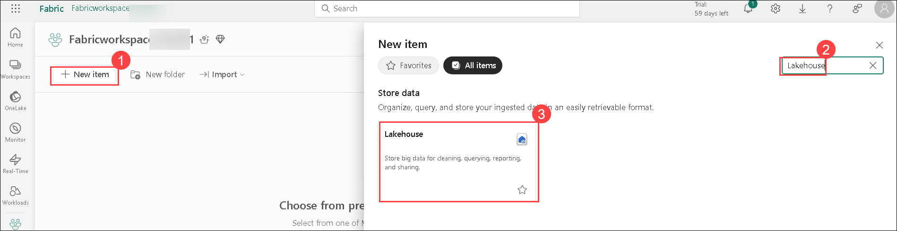

1. On the **New Lakehouse** page, enter the name as **Lakehouse<inject key="DeploymentID" enableCopy="false"/> (1)**, and select **Create (2)**.

   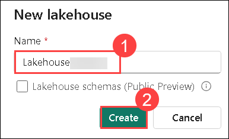

1. View the new lakehouse, and note that the **Lakehouse explorer** pane on the left enables you to browse tables and files in the lakehouse:

   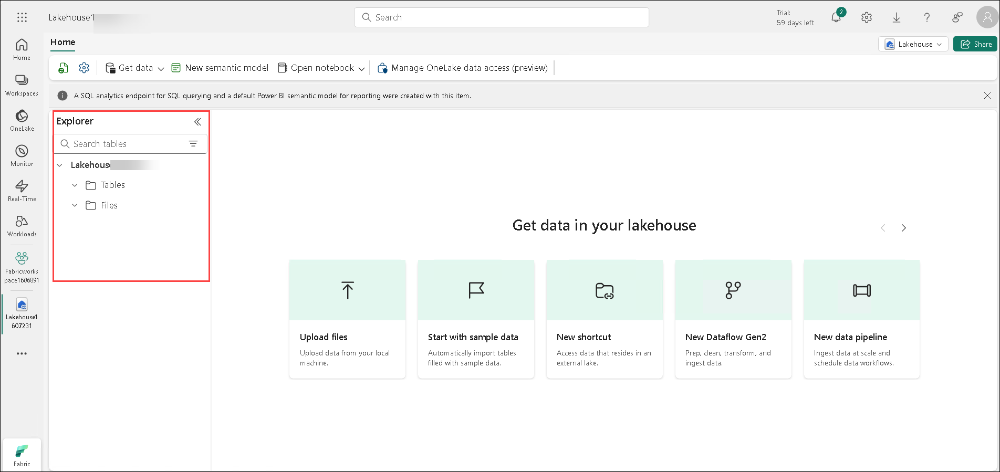
    
    - The **Tables** folder contains tables that you can query using SQL. Tables in a Microsoft Fabric lakehouse are based on the open source *Delta Lake* file format, commonly used in Apache Spark.
    
    - The **Files** folder contains data files in the OneLake storage for the lakehouse that aren't associated with managed delta tables. You can also create *shortcuts* in this folder to reference data that is stored externally.
    
      >**Note:** Currently, there are no tables or files in the lakehouse.

  >**Congratulations** on completing the Task! Now, it's time to validate it. Here are the steps:
  > - Hit the Validate button for the corresponding task. If you receive a success message, you have successfully validated the lab. 
  > - If not, carefully read the error message and retry the step, following the instructions in the lab guide.
  > - If you need any assistance, please contact us at labs-support@spektrasystems.com.

   <validation step="edbc75e2-8634-4dbb-9a62-f9c74b4a9849" />

## Task 3: Ingest data

In this task, you will ingest data into your lakehouse using a Copy Data activity in a pipeline. This method allows you to extract data from a source and copy it into a file within the lakehouse for further processing and analysis.

1. On the **Home** page for your lakehouse, select **Get data (1)** drop-down, select **New data pipeline (2)**.

   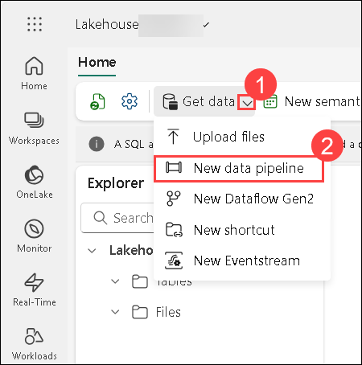

1. Create a new data pipeline named **Ingest Data (1)** and then click on **Create (2)**.

   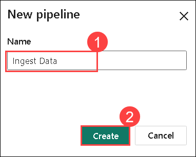

1. In the **Copy Data into Lakehouse** wizard, on the **Choose data source** page, select the **Sample data (1)** and then select the **NYC Taxi - Green (2)**.
   
   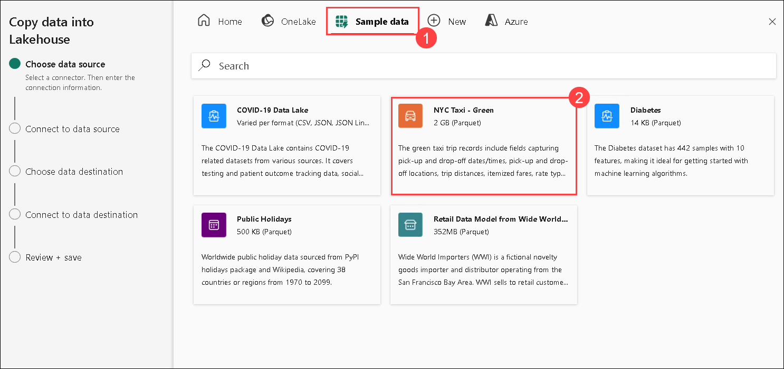

1. On the **Connect to data source** page, view the tables in the data source. There should be one table that contains details of taxi trips in New York City. Then select **Next** to progress to the **Choose data destination** page.

   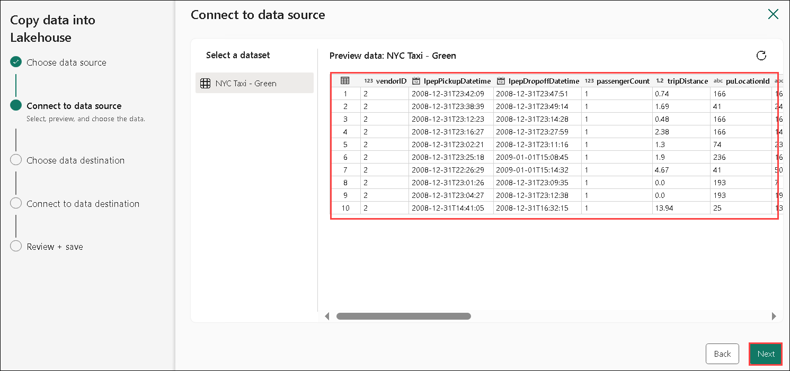

1. On the **Connect to data destination** page, Set the following data destination options, and then select **Next (6)**:
    - Connection: Make sure **Lakehouse<inject key="DeploymentID" enableCopy="false"/> (1)**
    - Root folder: **Tables** **(2)**
    - Load settings: **Load to new table (3)**
    - Destination table name: **taxi_rides (4)** *(You may need to wait for the column mappings preview to be displayed before you can change this)*
    - Column mappings: *Leave the default mappings as-it-is*
    - Enable partition: **Unselected (5)**

      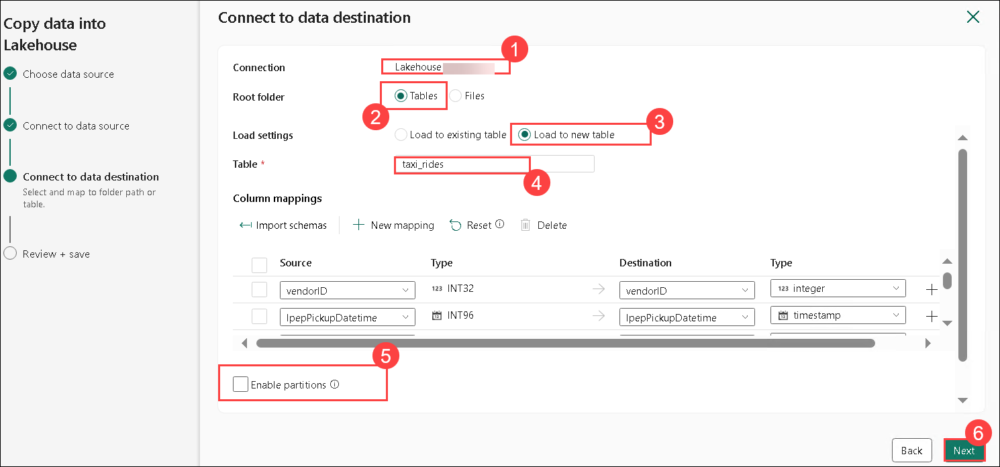


1. On the **Review + save** page, ensure that the **Start data transfer immediately** option is selected, and then select **Save + Run**.

   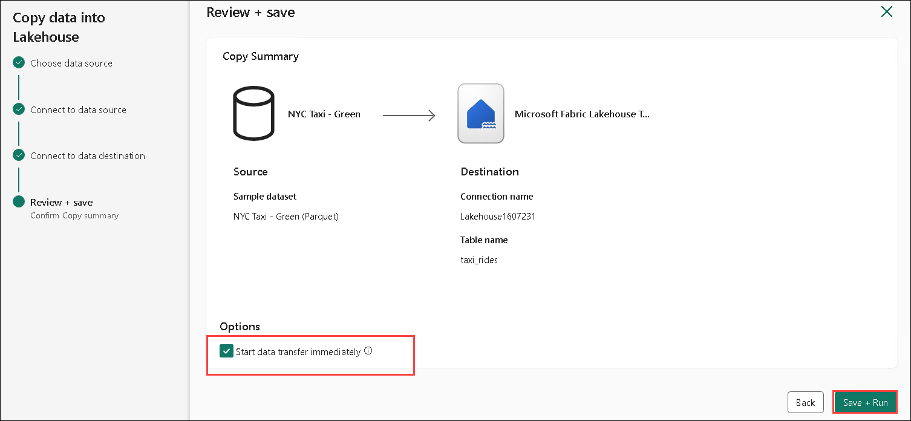

1. A new pipeline containing a **Copy Data** activity is created, as shown here:

   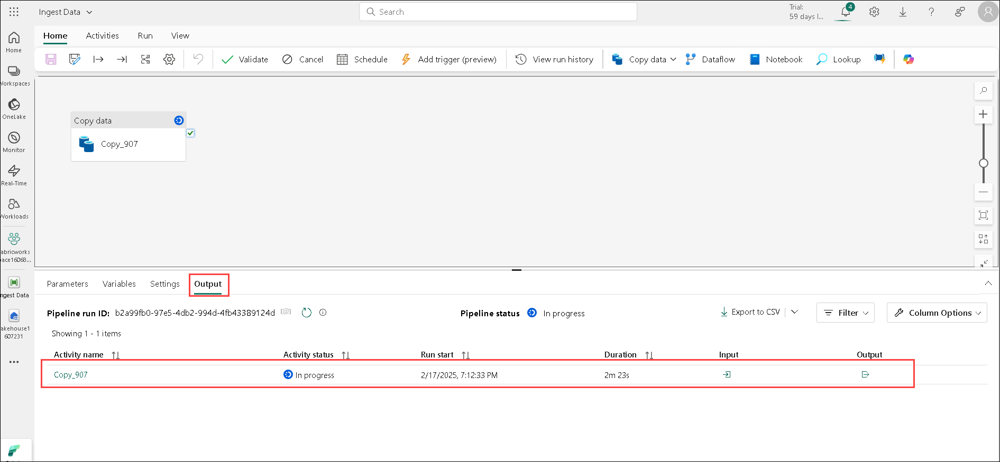

    >**Note:** When the pipeline starts to run, you can monitor its status in the **Output** pane under the pipeline designer. Use the **&#8635;** (*Refresh*) icon to refresh the status, and wait until it has **Succeeded** (which may take **10 minutes or more**).

     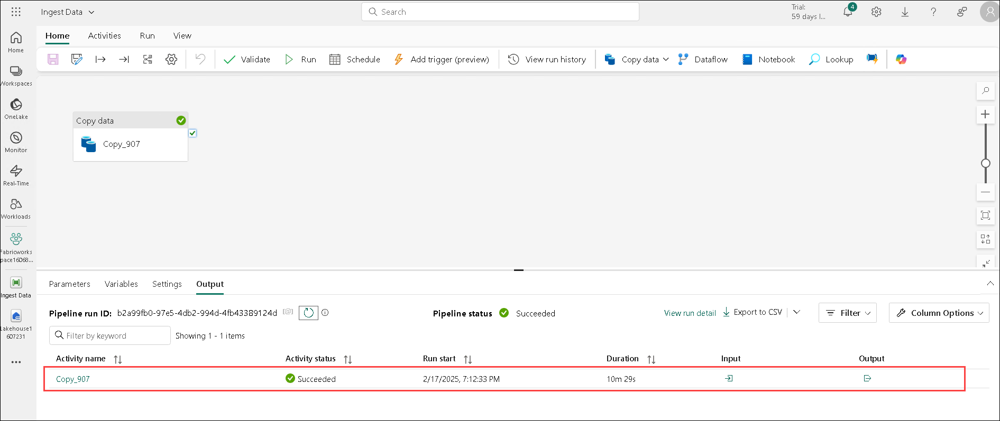

1. In the hub menu bar on the left, select your lakehouse named **Lakehouse<inject key="DeploymentID" enableCopy="false"/>**.

   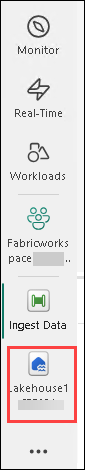

1. On the **Home** page, in the **Lakehouse explorer** pane, in the **...** menu for the **Tables** node, select **Refresh** and then expand **Tables** to verify that the **taxi_rides** table has been created.

   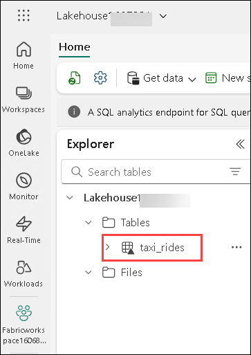

    >**Note**:If the new table is listed as *unidentified*, use its **Refresh** menu option to refresh the view.
    
1. Select the **taxi_rides** table to view its contents.

   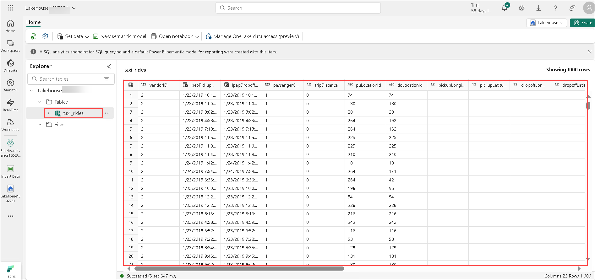

## Task 4: Query data in a lakehouse

In this task, you will use SQL to query the data that you have ingested into a table in the lakehouse. Querying data allows you to retrieve, filter, and analyze the information stored in your lakehouse for insights and decision-making.

1. At the top right of the Lakehouse page, switch from **Lakehouse** view to the **SQL analytics endpoint** for your lakehouse.

   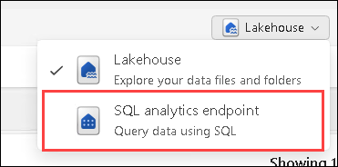

1. In the toolbar, select **New SQL query (1)**. Then enter the following SQL code into the query editor: **(2)**

    ```sql
    SELECT  DATENAME(dw,lpepPickupDatetime) AS Day,
            AVG(tripDistance) As AvgDistance
    FROM taxi_rides
    GROUP BY DATENAME(dw,lpepPickupDatetime)
    ```

1. Select the **&#9655; Run (3)** button to run the query and review the results, which should include the average trip distance for each day of the week. **(4)**

    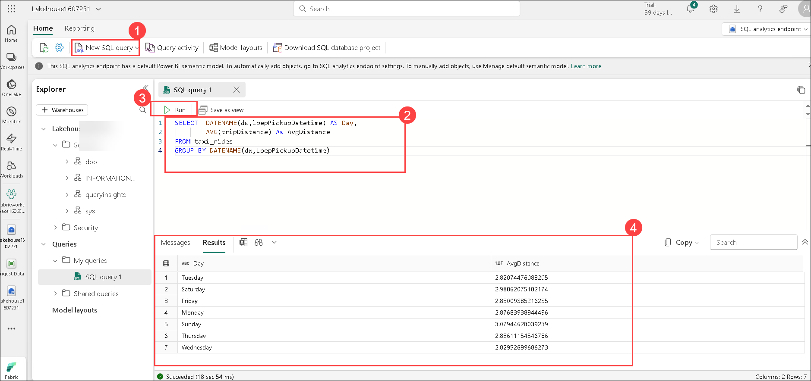

## Task 5: Visualize data in a lakehouse

In this task, you will create visualizations and reports using the data stored in your Microsoft Fabric lakehouse.

1. At the bottom left of the page, under the **Explorer** pane, select the **Model layouts (1)** tab to see the data model for the tables in the lakehouse (this includes system tables as well as the **taxi_rides (2)** table).

    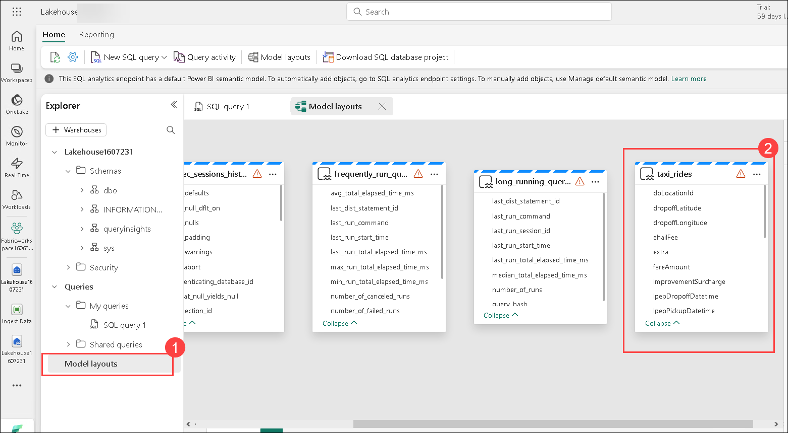

1. In the toolbar, click on **Reporting (1)** tab and then select **New report (2)** to create a new report based on the **taxi_rides**.

    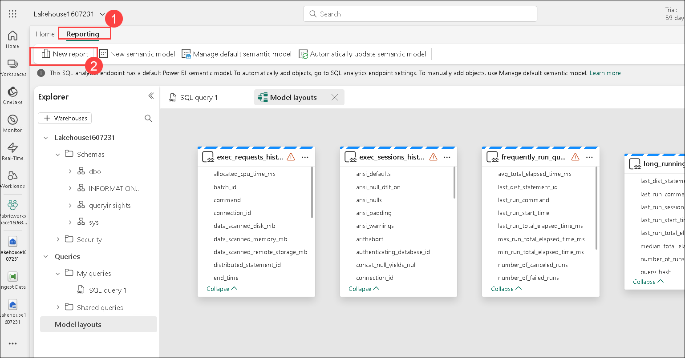

1. Click on **Continue** for **New report with all available data**.

    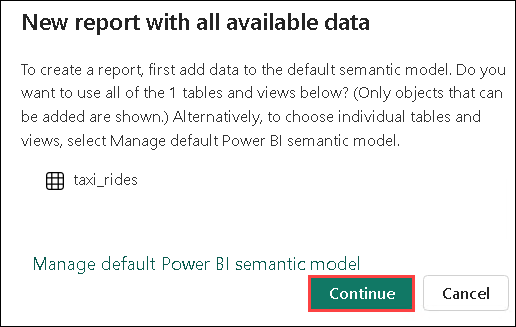
   
1. In the report designer:
    - In the **Data** pane, expand the **taxi_rides (1)** table and select the **lpepPickupDatetime (2)** and **passengerCount (3)** fields.
    - In the **Visualizations** pane, select the **Line chart (4)** visualization. Then ensure that the **X-axis** contains the **lpepPickupDatetime (5)** field and the **Y** axis contains **Sum of passengerCount (6)**.
       
      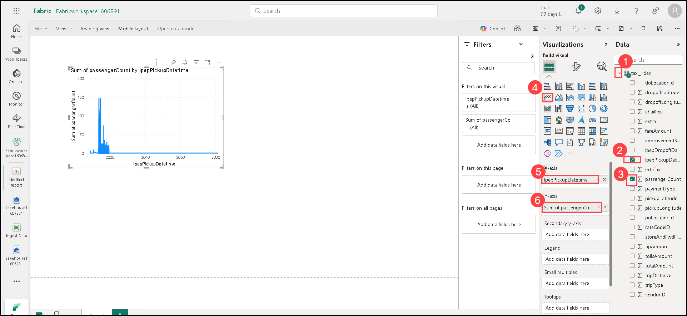

       **Tip**: You can use the **>>** icons to hide the report designer panes in order to see the report more clearly.

1. On the **File (1)** menu, select **Save (2)** to save the report.

    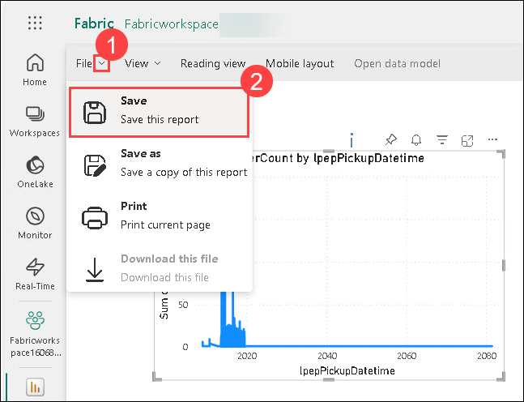

1. Save the file as **Taxi Rides Report (1)** in your Fabric workspace then click on **Save (2)**.

    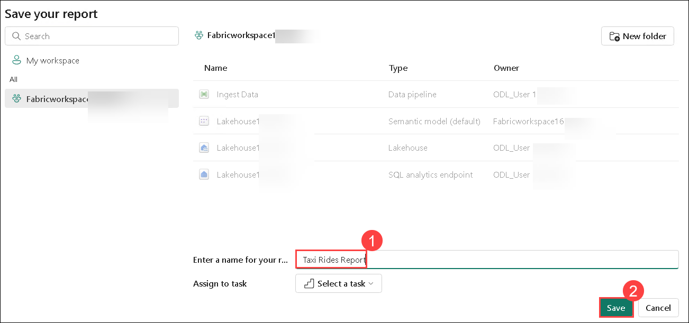

1. You can find the report in the page for your workspace in the Microsoft Fabric portal.

1. Navigate to your Fabric workspace **(1)** and there you can see the created report **(2)**.

    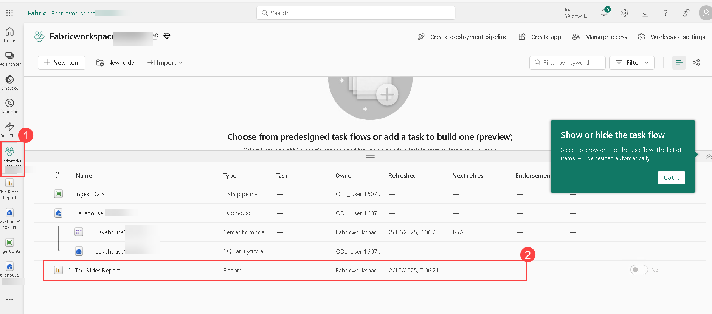

  >**Congratulations** on completing the Task! Now, it's time to validate it. Here are the steps:
  > - Hit the Validate button for the corresponding task. If you receive a success message, you have successfully validated the lab. 
  > - If not, carefully read the error message and retry the step, following the instructions in the lab guide.
  > - If you need any assistance, please contact us at labs-support@spektrasystems.com.

   <validation step="b016c5bb-cccd-4821-9464-697aa7036d09" />

### Task 6: Remove the workspace

In this task, you will delete the workspace you created for this exercise. Removing the workspace will clean up all associated resources, including the lakehouse, data pipelines, and reports, ensuring that no unnecessary storage or costs accumulate.

1. In the bar on the left, select the icon for your workspace **Fabricworkspace<inject key="DeploymentID" enableCopy="false"/> (1)**, then click on ***Workspace settings (2)**.

       

1. In the **General** section, select **Remove this workspace**.

       

1. Click on **Delete** do delete the workspace.

          

## Review
In this lab, you have completed:
- Create the workspace
- Created a lakehouse
- Ingested data
- Queried data in a lakehouse
- Visualized data in a lakehouse
- Removed the workspace
  
## You have successfully completed this lab
