# Lab 05: Explore Azure Stream Analytics

## Lab scenario
In this lab, you will set up and explore Azure Stream Analytics by provisioning the necessary resources, configuring real-time data processing, and analyzing streaming data. You will use Azure Cloud Shell to automate resource creation, examine the setup in the Azure portal, and run a Stream Analytics job to process and store IoT data in real time.

## Lab objectives

In this lab, you will complete the following tasks:

+ Task 1: Create Azure resources
+ Task 2: Explore the Azure resources
+ Task 3: Use the resources to analyze streaming data
  
## Estimated timing: 15 minutes

## Architecture diagram

.png)  

## Lab Prerequisites

Before starting this lab, you should have the following prerequisites:

  - An active **Azure subscription** with permissions to create and manage resources.
  - Access to **Azure Cloud Shell** (Bash or PowerShell) for executing Azure CLI commands.
  - Basic knowledge of **Azure Stream Analytics** and real-time data processing concepts.

## Exercise 1: Analyze streaming data

### Task 1: Create Azure resources

In this task, you will set up the necessary Azure resources for the lab, including an Azure IoT Hub, Storage Account, and Stream Analytics job. You will use Azure Cloud Shell to execute commands and automate resource creation.

1. On the  Azure Portal, click on the  **[>_]**  button to the right of the search bar at the top of the page to create a new Cloud Shell.

    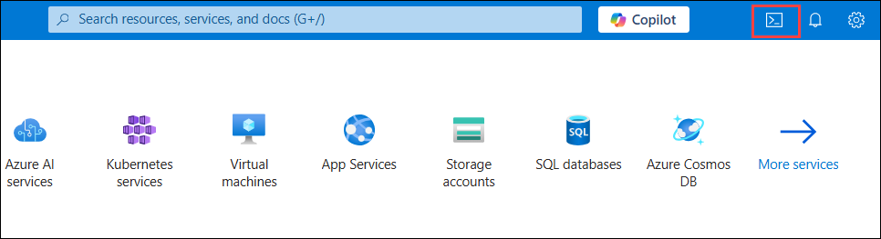

1. If prompted to select either Bash or PowerShell, select **Bash**.

1. On the **Getting started** page, selct **No storage account required (1)**, then select your **Subscription** **(2)** and then click on **Apply (3)**.
     
    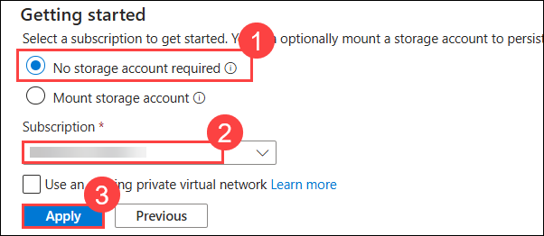

1. The cloud shell provides a command line interface in a pane at the bottom of the Azure portal.

1. In the Azure Cloud Shell, enter the following command to download the files you'll need for this exercise.
    
    ```
    git clone https://github.com/CloudLabs-MOC/DP-900T00A-Azure-Data-Fundamentals dp-900
    
    ```

    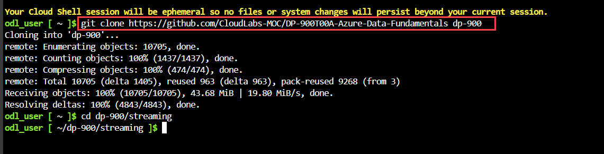    
    
1. Wait for the command to complete, and then enter the following command to change the current directory to the folder containing the files for this exercise.
        
    ```
    cd dp-900/streaming
    
    ```
    
    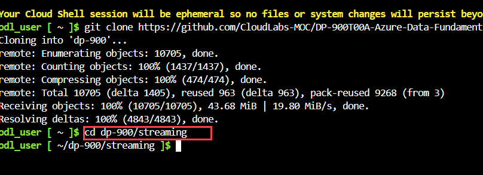    

1. Enter the following command to run a script that creates the Azure resources you will need in this exercise.
       
    ```
    bash setup.sh
    
    ```
    
    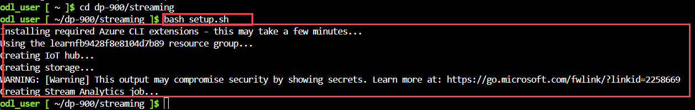

     >**Note:** Please ignore any warnings about experimental extensions

    - Wait as the script runs and as it performs the following actions:
    
        - Installs the **Azure CLI** extensions needed to create resources
        - Identifies the Azure resource group provided for this exercise, which will have a name similar to  **learnxxxxxxx** (Where `xxxxxxx` is some random letters)
        - Creates an  _Azure IoT Hub_  resource, which will be used to receive a stream of data from a simulated device
        - Creates a  _Azure Storage Account_, which will be used to store processed data
        - Creates a  _Azure Stream Analytics_  job, which will process the incoming device data in real-time, and write the results to the storage account

### Task 2: Explore the Azure resources

In this task, you will explore the Azure resources created for the lab, including an IoT Hub, Storage Account, and Stream Analytics job. You will review their configurations in the Azure portal, ensuring the correct setup for processing real-time streaming data.

1.  In the  [Azure portal](https://portal.azure.com/), on the home page, select  **Resource groups**  to see the resource groups in your subscription.

1. This should include the  **learnxxxxxx** resource group identified by the setup script.

    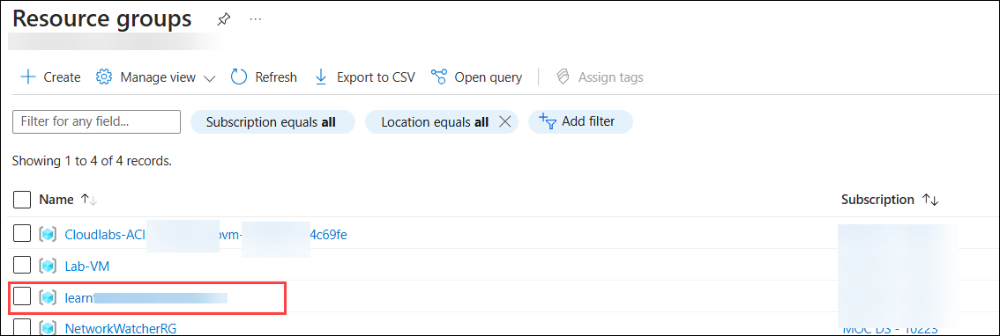
    
1. Select the  **learnxxxxxx**  resource group, and review the resources it contains, which should include:
    
    - An  _IoT Hub_  named  **iothubxxxxxx**, which is used to receive incoming device data.
    - A  _Storage account_  named  **storexxxxxxx**, to which the data processing results will be written.
    - A  _Stream Analytics job_  named  **streamxxxxxx**, which will be used to process streaming data.

      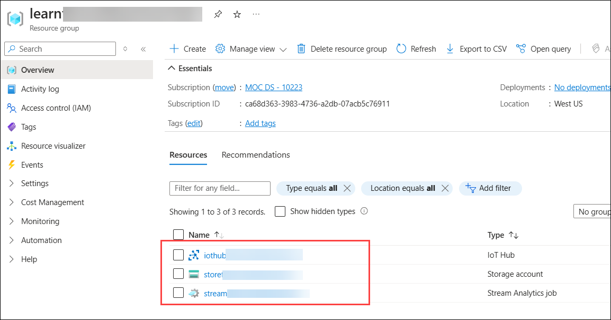    
    
       >**Note:** If all three of these resources are not listed, click the  **↻ Refresh**  button until they appear.

       >**Note:** Where `xxxxxxx` is some random letters
    
1. Select the **streamxxxxxxxxxxxxx**  Stream Analytics job.

    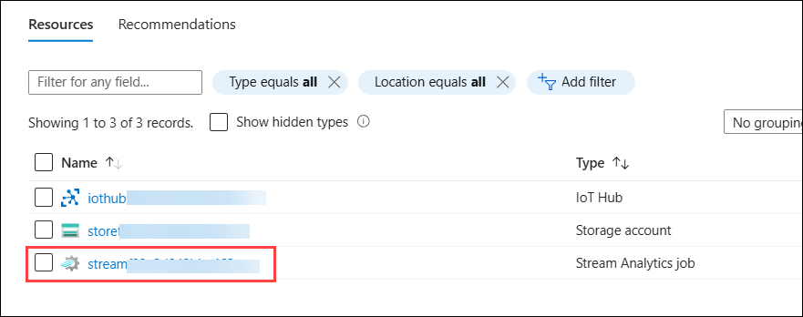

1. View the information on its  **Overview**  page, note the following details:

1. Select **Inputs (1)** under J**ob topology** on the left hand pane, verify that the job has one  _input_  named  **iotinput (2)**.

    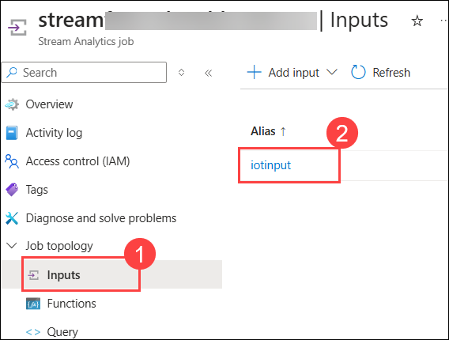

1. Select **Outputs (1)** under **Job topology** on the left hand pane, verify that the job has one  _output_ named  **bloboutput (2)** .
    
    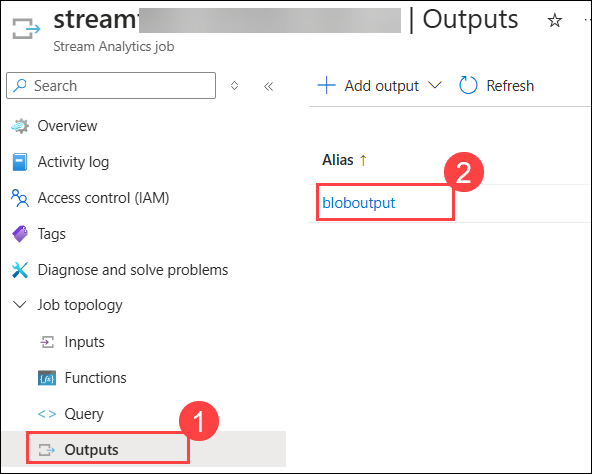

1. These reference the **IoT Hub** and **Storage account** created by the setup script.

1. Select **Query (1)** under **Job topology** on the left hand pane, the job has a  _query_ , which reads data from the  **iotinput**  input, and aggregates it by counting the number of messages processed every **10** seconds; writing the results to the  **bloboutput**  output. **(2)**

    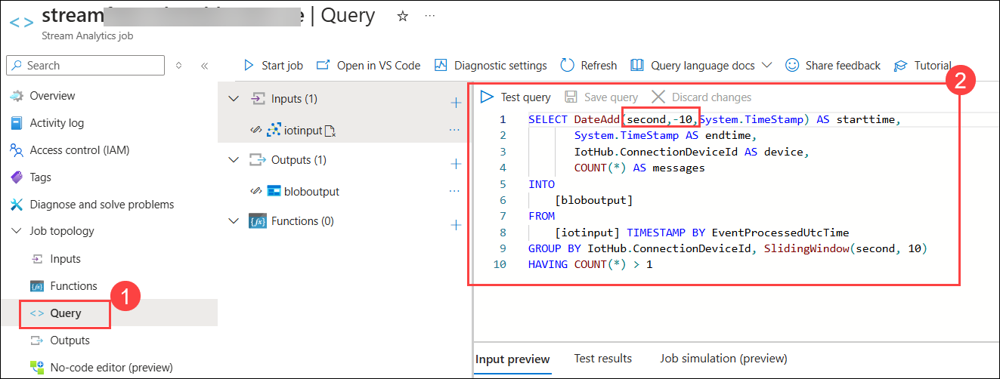

### Task 3:  Use the resources to analyze streaming data

In this task, you will start the Stream Analytics job, simulate real-time data streaming from an IoT device, and analyze the processed results stored in an Azure Storage Account. You will also explore the output data in JSON format and verify that the Stream Analytics job processes messages in real time. Finally, you will stop the job after completing the analysis.

1.  At the top of the  **Overview**  page of the Stream Analytics job, select the  **▷ Start job**  button.

    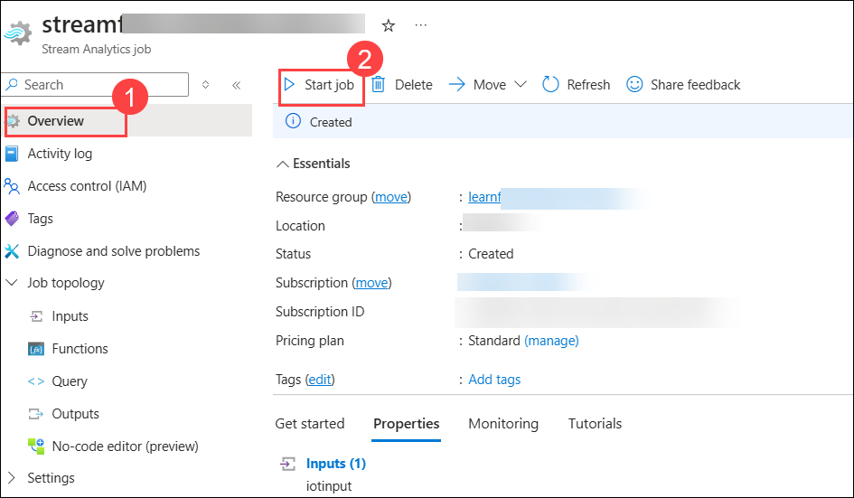

1. Then in the  **Start job**  pane, select  **Start**  to start the job.

    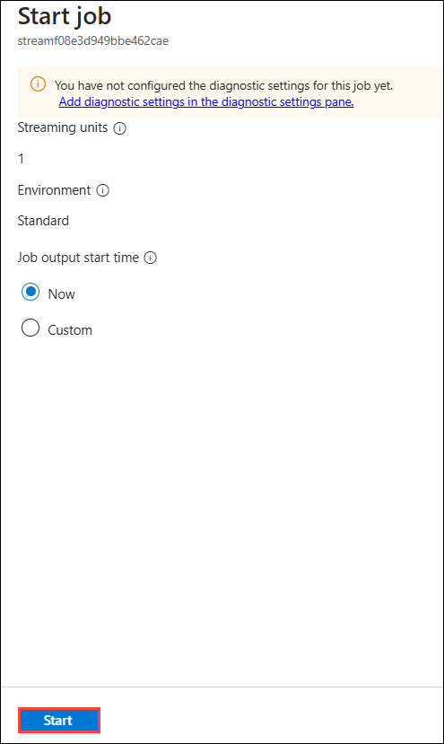
    
1. Wait for a notification that the **Streaming job started successfully**.
    
1. Switch back to the Azure Cloud Shell, and enter the following command to simulate a device that sends data to the IoT Hub.
    
    ```
    bash iotdevice.sh
    
    ```  

1. Wait for the simulation to start, which will be indicated by output like this:
     
    ```
    Device simulation in progress: 6%|#    | 7/120 [00:08<02:21, 1.26s/it]
    
    ```

    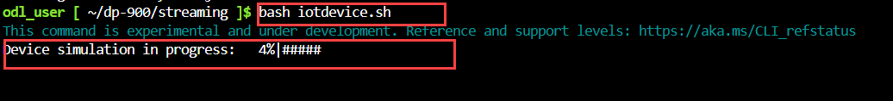      
      
1. While the simulation is running, back in the Azure portal, return to the page for the  **learnxxxxxxxx**  resource group, and select the  **store*xxxxxxxxxxxx***  storage account.

    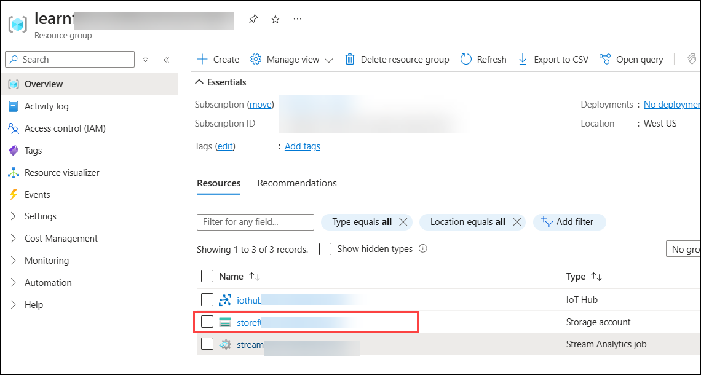  
    
1. In the pane on the left of the storage account blade, select the  **Containers (1)**  tab. Open the  **data (2)**  container.

    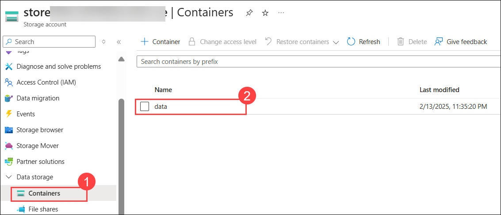  
    
1. In the  **data**  container, navigate through the folder hierarchy, Keep click on it, which includes a folder for the current **year**, with subfolders for the **month, day, and hour**. 

    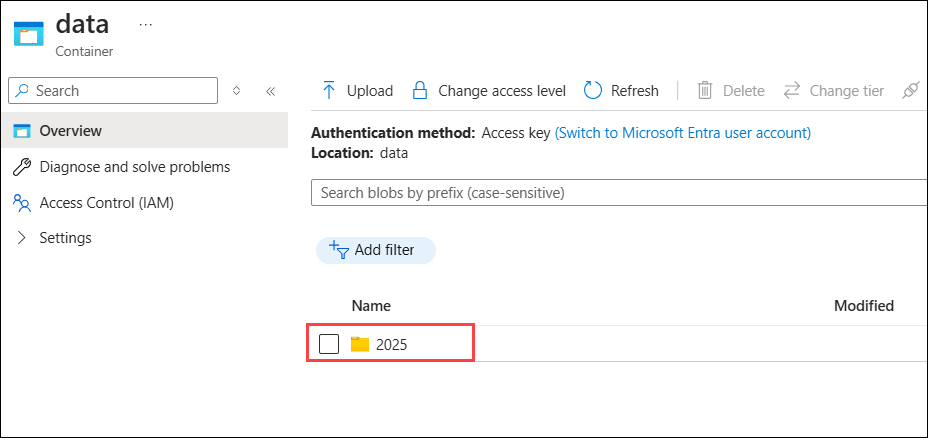  
    
1. In the folder for the hour, select the file that has been created, which should have a name similar to  **0_xxxxxxxxxx.json**.

    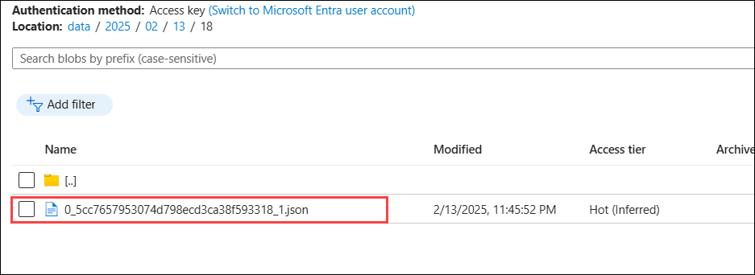  

1. On the page for the file, select  **Edit**, and review the contents of the file.

    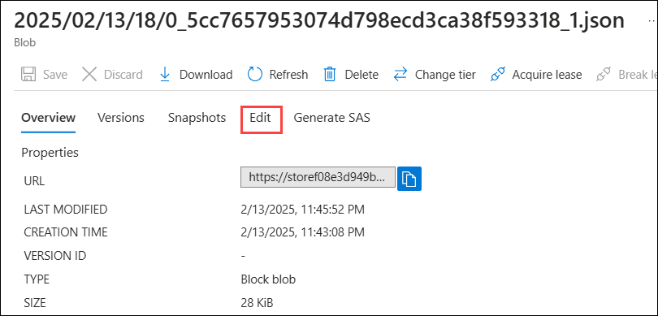  

1. The file which should consist of a JSON record for each **10** second period, showing the number of messages received from IoT devices, like this:
     
     ```
      {"starttime":"2021-10-23T01:02:13.2221657Z","endtime":"2021-10-23T01:02:23.2221657Z","device":"iotdevice","messages":2}
      {"starttime":"2021-10-23T01:02:14.5366678Z","endtime":"2021-10-23T01:02:24.5366678Z","device":"iotdevice","messages":3}
      {"starttime":"2021-10-23T01:02:15.7413754Z","endtime":"2021-10-23T01:02:25.7413754Z","device":"iotdevice","messages":4}
    
     ```

     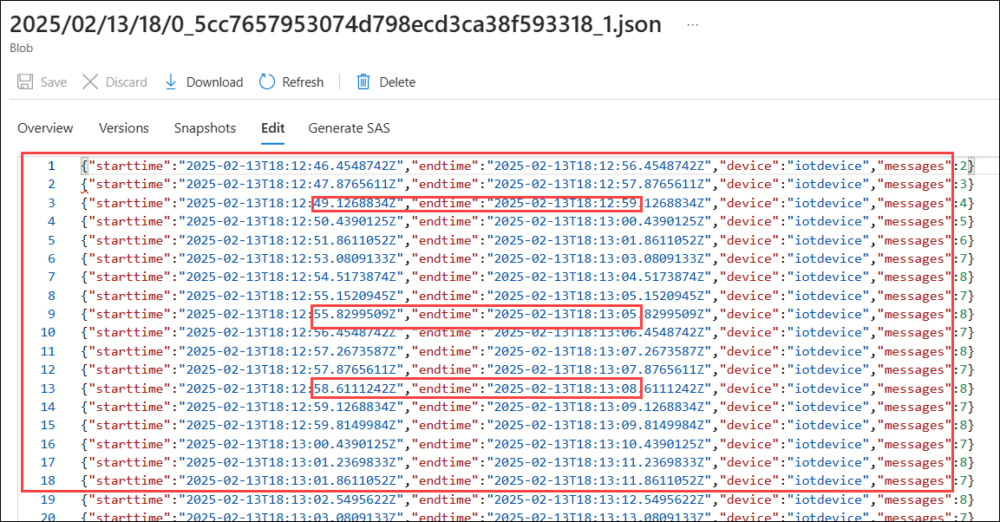        
    
1. Use the  **↻ Refresh**  button to refresh the file, nothing that additional results are written to the file as Stream Analytics job processes the device data in real time as it is streamed from the device to the IoT Hub.
    
1. Return to the **Azure Cloud Shell** and wait for the device simulation to finish (it should run for around 3 minutes).

    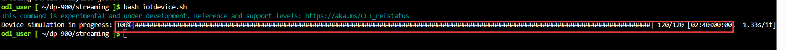  
    
1. Back in the Azure portal, refresh the file one more time to see the full set of results that were produced during the simulation.
    
1. Return to the  **learnxxxxxxx**   resource group, and re-open the  **streamxxxx**  Stream Analytics job.
    
1. At the top of the **Stream Analytics job** page, use the  **⬜ Stop**  button to stop the job, confirming when prompted.

    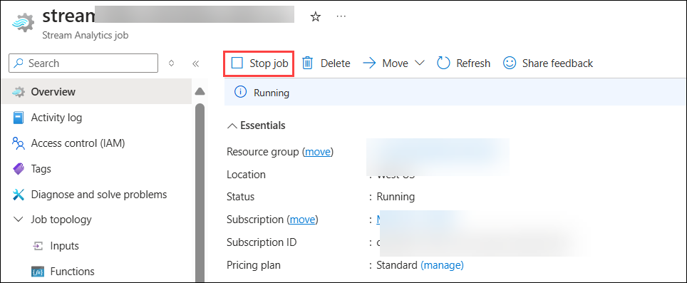  

  >**Congratulations** on completing the Task! Now, it's time to validate it. Here are the steps:
  > - Hit the Validate button for the corresponding task. If you receive a success message, you have successfully validated the lab. 
  > - If not, carefully read the error message and retry the step, following the instructions in the lab guide.
  > - If you need any assistance, please contact us at labs-support@spektrasystems.com.

   <validation step="77227332-e069-4db9-a853-9c633839e3fa" />
   
## Review
In this lab, you have completed:
- Create Azure resources
- Explore the Azure resources
- Use the resources to analyze streaming data
  
## You have successfully completed this lab

