# Lab 5a: Explore Spark Streaming in Azure Synapse Analytics

## Lab scenario 

In this lab, you will provision an Azure Synapse Analytics workspace as a unified environment for data integration and analytics. You will create a Spark pool to enable distributed data processing and support large-scale data workloads. Additionally, you will explore stream processing using Spark Structured Streaming and Delta tables. Through a guided notebook, you will perform real-time data processing and analysis within your Synapse workspace.

## Lab Objectives

In this lab, you will perform the following tasks:

+ Task 1: Create a Synapse Analytics workspace
+ Task 2: Create a Spark pool
+ Task 3: Explore stream processing
  
## Estimated timing: 30 minutes

## Architecture diagram

.png)

## Exercise 1: Provision a Synapse Analytics workspace and Spark Pool

In this exercise, you will create an Azure Synapse Analytics workspace, set up a Spark pool for distributed data processing, and explore stream processing to analyze real-time data. Through these tasks, you will gain hands-on experience in configuring and working with Synapse Analytics for big data and streaming workloads.

### Task 1: Create a Synapse Analytics workspace

In this task, you will create an Azure Synapse Analytics workspace, providing a unified environment for data integration and analytics.
    
1. In the Azure portal, on the **Home** page, use the **&#65291; Create a resource** icon to create a new resource.

    

1. Search for **Azure Synapse Analytics (1)** and select **Azure Synapse Analytics (2)**.

    

1. On the **Azure Synapse Analytics** page, click on **Create (1)** drop down and then click on **Azure Synapse Analytics (2)**.

    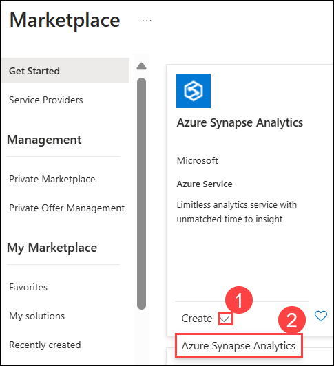

1. Create a new **Azure Synapse Analytics** resource with the following settings:

    - Subscription: **Leave your Azure subscription (1)**
    - Resource group: Select existing resource group,  **DP-900-Module-5-<inject key="DeploymentID" enableCopy="false"/> (2)**
    - Manage resource group: Leave blank **(3)**
    - Workspace name: Enter **synapse-ws-<inject key="DeploymentID" enableCopy="false"/> (4)**
    - **Region**: **Central US (5)**
    - Select Data Lake Storage Gen 2: **From subscription (6)**
    - Account name: Click on **Create new**, then  enter **datalake<inject key="DeploymentID" enableCopy="false"/> (7)** and then select **Ok**
    - File system name: Click on **Create new**, then enter **fs<inject key="DeploymentID" enableCopy="false"/> (8)** and then select **Ok**
    - Click on **Review+create (9)**
    
      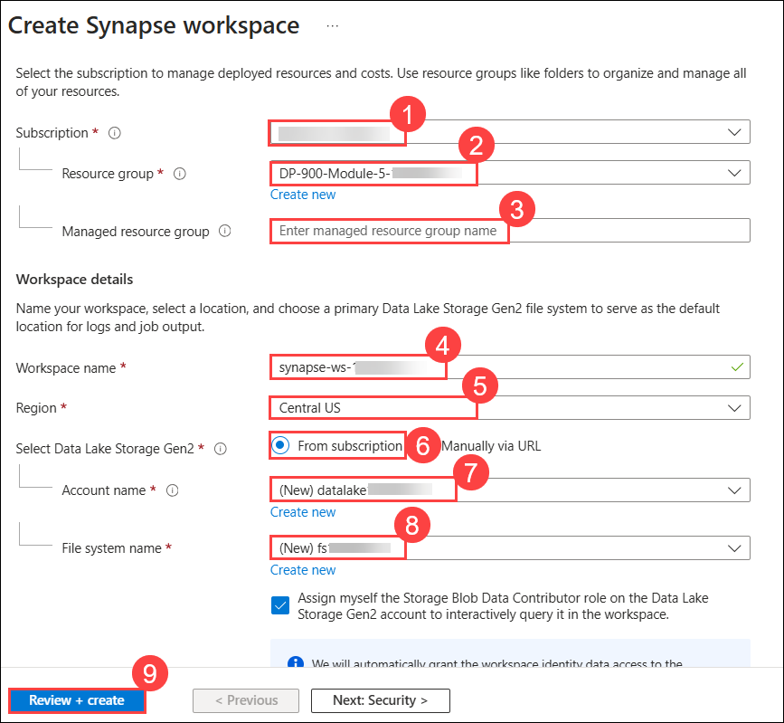
        
1. Then select **Create** to create the workspace.

1. Wait for the workspace to be created - this may take five minutes or so.

1. When deployment is complete, click on **Go to respurce group** to go to the resource group that was created and notice that it contains your **Synapse Analytics workspace** and  **Data Lake storage account**.

    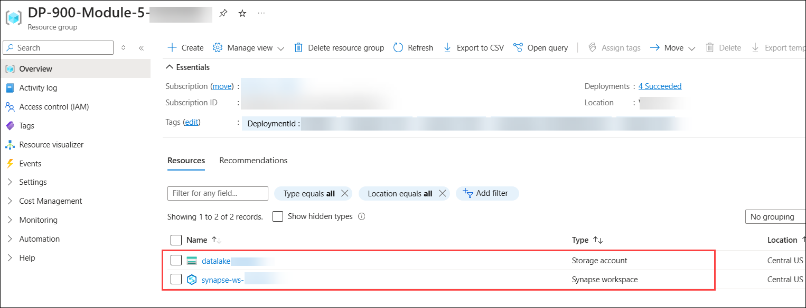
   
1.  Select your Synapse workspace **synapse-ws-<inject key="DeploymentID" enableCopy="false"/>**.

    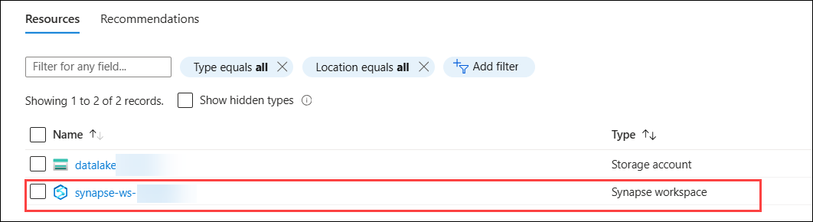

1. On the  **Overview (1)**  page, scroll down to the  **Open Synapse Studio (2)**  card, select  **Open (3)**  to open Synapse Studio in a new browser tab. Synapse Studio is a web-based interface that you can use to work with your Synapse Analytics workspace.

    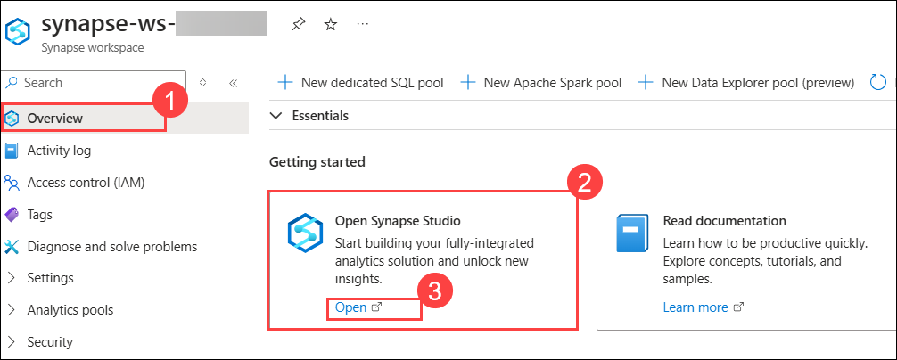
    
1.  On the left side of Synapse Studio, use the  **››**  icon to expand the menu - this reveals the different pages within Synapse Studio that you'll use to manage resources and perform data analytics tasks, as shown here:
    
    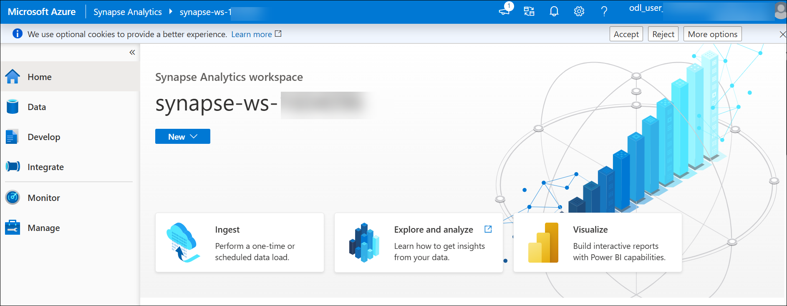
    
 
 ### Task 2: Create a Spark pool

In this task, you will create a Spark pool in your Azure Synapse Analytics workspace to enable distributed data processing. This Spark pool will be essential for handling streaming data and performing large-scale analytics in the next tasks.

1. In Synapse Studio, select the **Manage (1)** page. Select the **Apache Spark pools (2)** tab, and then use the **&#65291; New (3)** icon to create a new Spark pool.

    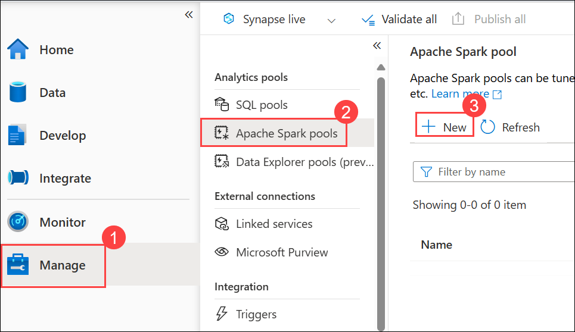

1. Creta a **New Apache Spark pool** with the following settings:

    - Apache Spark pool name: **spark<inject key="DeploymentID" enableCopy="false"/> (1)**
    - Node size family: **Memory Optimized (2)**
    - Node size: **Small (4 vCores / 32 GB) (3)**
    - Autoscale: **Enabled (4)**
    - Number of nodes: **3----3 (5)**
    - Click on **Review+create (6)**

      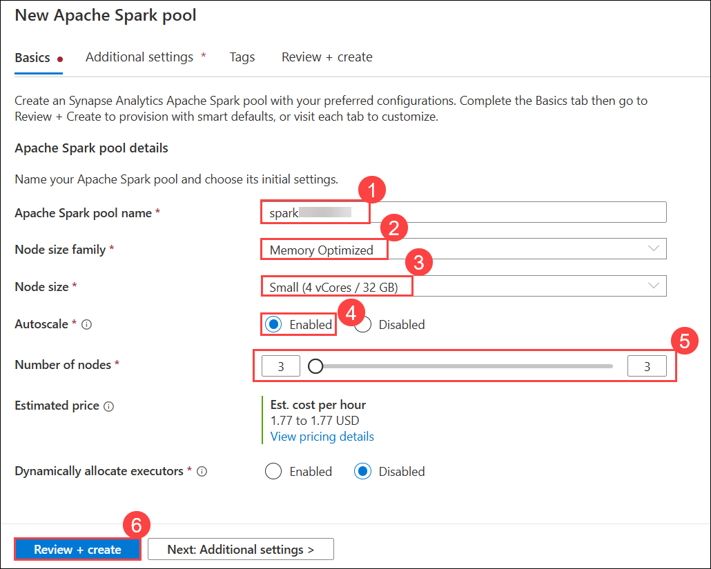

1. Click on **Create**, then wait for it to be deployed (which may take a few minutes).
   
### Task 3: Explore stream processing

In this task, you will explore stream processing using Spark Structured Streaming and Delta tables. You will work with a notebook containing Python code and guided instructions to perform real-time data processing and analysis within your Azure Synapse Analytics workspace.

1. Right click on the following link [Structured Streaming and Delta Tables.ipynb](https://github.com/MicrosoftLearning/DP-900T00A-Azure-Data-Fundamentals/raw/master/streaming/Spark%20Structured%20Streaming%20and%20Delta%20Tables.ipynb), then click on **Copy link** and then paste it on the browser to download notebook.

1. Press **Ctrl+S** to save the file to your local folder.

1. Click on **Downloads (1)** and then select **Save (2)**.

    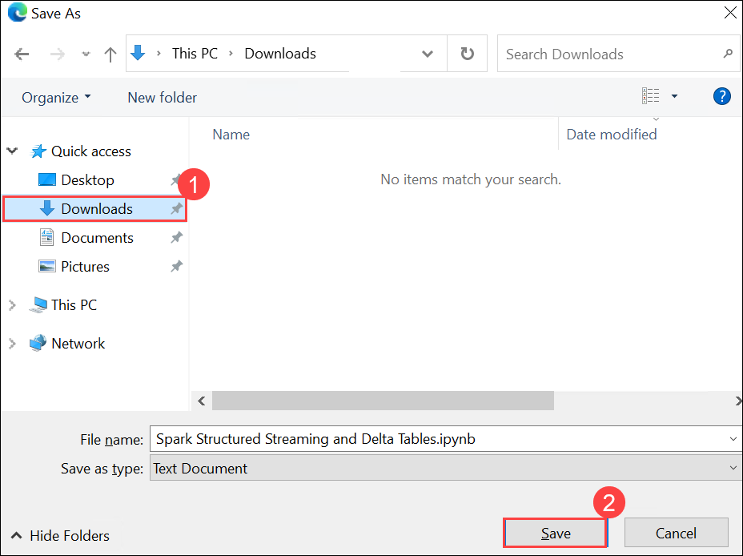

1. Open the downloaded file in **File Explorer** then click on **View (1)**, check the box of **File name extensions (2)**.

    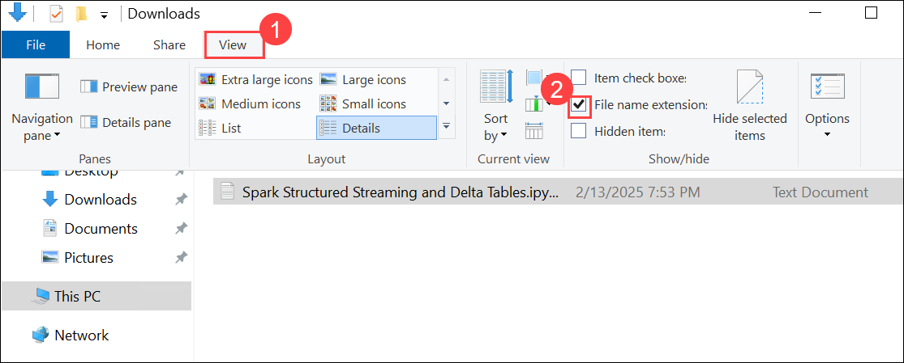

1. Right click on the file name **(1)** and then click on **Rename (2)**.

    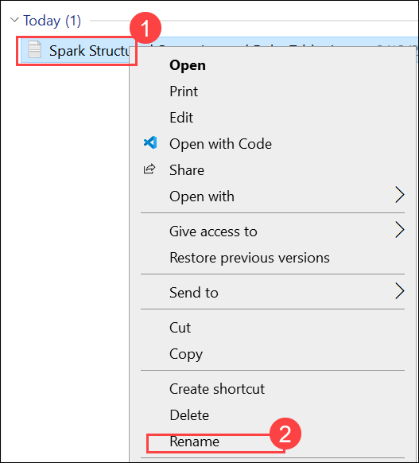

1. Rename it as **Structured Streaming and Delta Tables.ipynb**, if `.txt` extension is there remove it.

    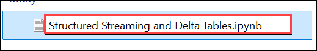

1. Clicl on **Yes** to change the file extension.

    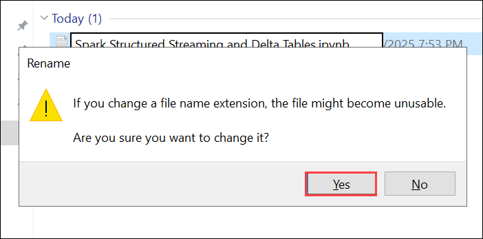

1. In Synapse Studio, select the **Develop (1)** page. On the **&#65291; (2)** menu, select **&#8612; Import (3)**.

    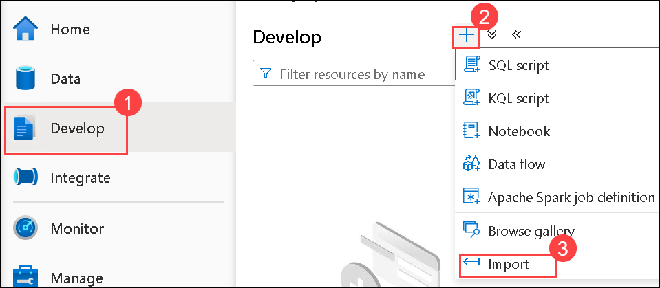

1. Navigate to **Downloads (1)**, then select the **Structured Streaming and Delta Tables.ipynb (2)** file in the file explorer and then click on **Open (3)**.

    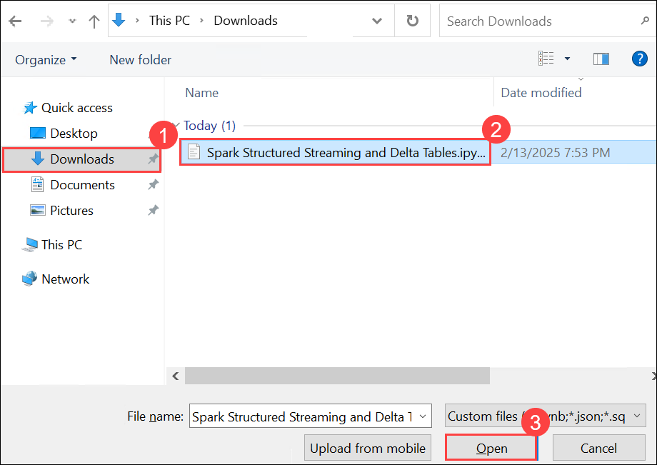

1. In the **Notebook** pane that opens, in the **Attach to** list, select the **spark<inject key="DeploymentID" enableCopy="false"/> (1)** Spark pool to created previously and ensure that the **Language** is set to **PySpark (Python) (2)**. You can see the **Notebook** **(3)**.

    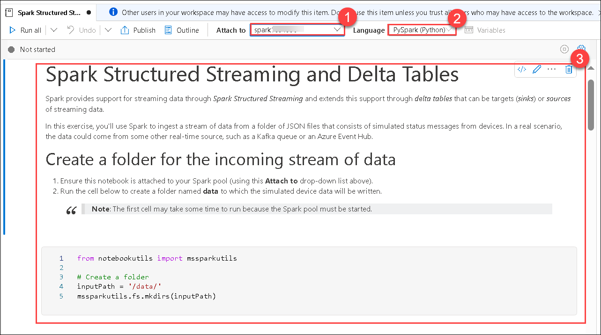

1. Follow the instructions in the notebook to attach it to your Spark pool.

1. **Run** the each code cells it contains to explore various ways to use Spark for stream processing.

    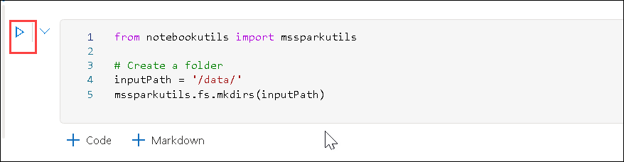

1. Wait untill the cell runs completely, this may take some time.

    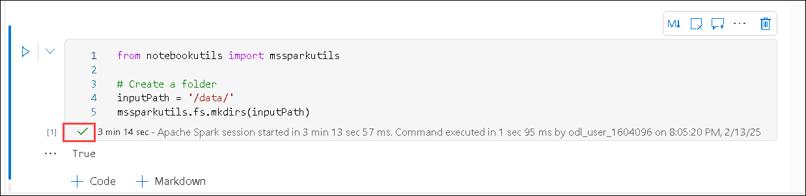

1. **Run** each cell one after the other.

1. At last you will be getting ouput similar to this.

    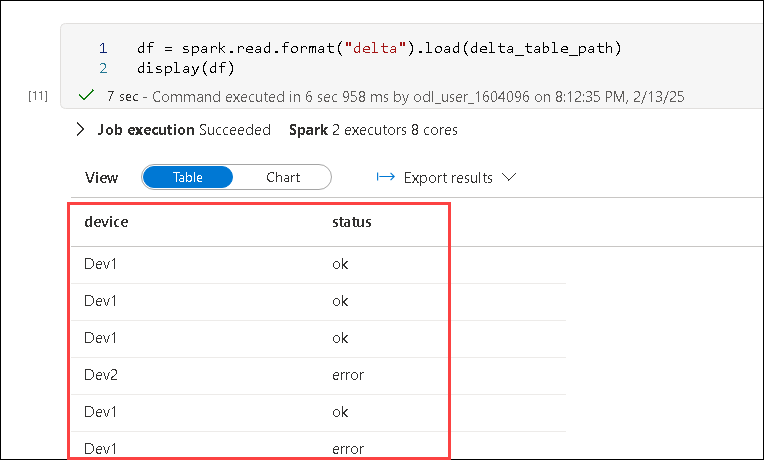

    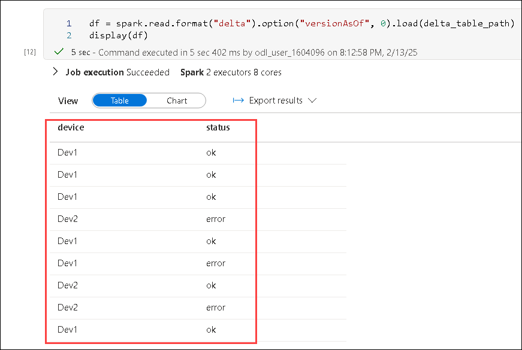    

  >**Congratulations** on completing the Task! Now, it's time to validate it. Here are the steps:
  > - Hit the Validate button for the corresponding task. If you receive a success message, you have successfully validated the lab. 
  > - If not, carefully read the error message and retry the step, following the instructions in the lab guide.
  > - If you need any assistance, please contact us at labs-support@spektrasystems.com.

   <validation step="fd970f3e-885a-419d-98cd-434ceda7621e" />

## Review
In this lab, you have completed:
- Create a Synapse Analytics workspace
- Create a Spark pool
- Explore stream processing
  
## You have successfully completed this lab

