# Lab 05b: Explore Azure Synapse Data Explorer

## Lab scenario

In this lab, you will explore Azure Synapse Analytics by setting up a workspace, configuring a Data Explorer pool, ingesting data into a database, and using Kusto Query Language (KQL) to query the data. This hands-on experience will help you understand how Synapse Analytics can be used for big data analysis and real-time querying.

## Lab objectives

In this lab, you will perform the following tasks:

+ Task 1: Create a Synapse Analytics workspace
+ Task 2: Create a Data Explorer pool
+ Task 3: Create a database and ingest data
+ Task 4: Use Kusto query language to query the table in Synapse Studio
  
## Estimated timing: 30 minutes

## Architecture diagram

.png)

## Exercise 1: Provision a Synapse Analytics workspace and Data Explorer pool

In this exercise, you will provision an Azure Synapse Analytics workspace and create a Data Explorer pool. These resources will provide a scalable environment for managing and analyzing large datasets using Kusto Query Language (KQL).

### Task 1: Create a Synapse Analytics workspace

In this task, you will verify the pre-created Synapse Analytics workspace, Data Lake storage account, and Apache Spark pool within the resource group. You will also navigate to Synapse Studio from the Synapse workspace to begin managing and analyzing data.

1. On the Azure portal, search for **Resource group (1)** and select for **Resource group (2)** from the services.

    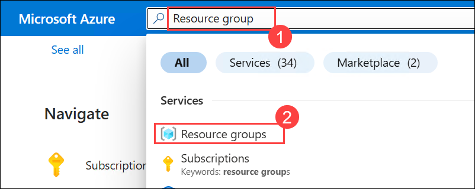

1. Open the resource group **DP-900-Module-5-<inject key="DeploymentID" enableCopy="false" />**  that was precreated for you from the Resource Group tab.

    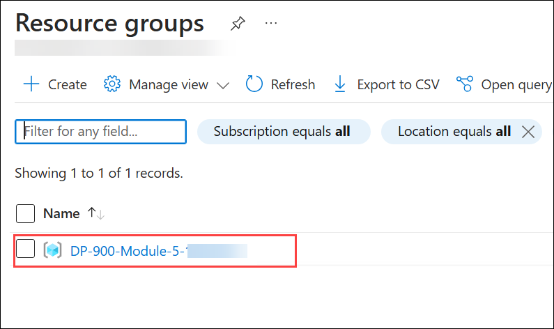

1. Notice that it contains your **Synapse Analytics workspace, a Data Lake storage account** and an **Apache Spark pool**.

    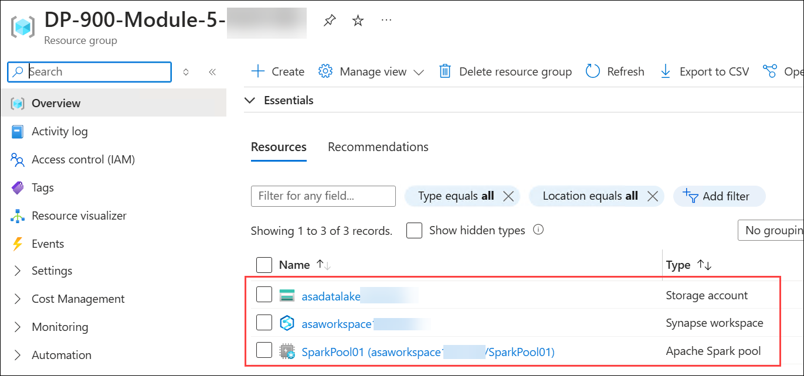
    
1. Select your **Synapse workspace**.

    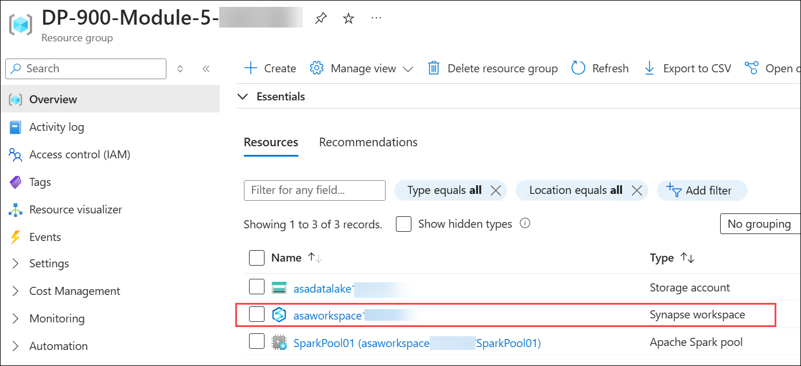

1. On its **Overview (1)**  page, in  **Open Synapse Studio (2)**  card, select  **Open (3)**  to open Synapse Studio in a new browser tab. 

    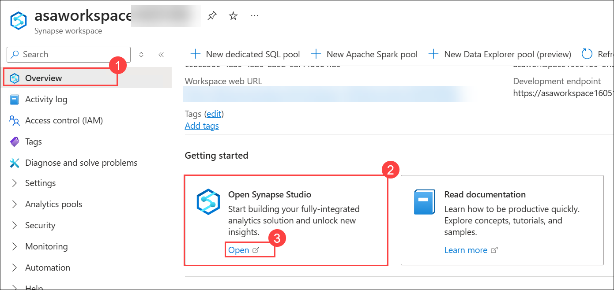

     >**Note:** Synapse Studio is a web-based interface that you can use to work with your Synapse Analytics workspace.
    
1. On the left side of Synapse Studio, use the  **››**  icon to expand the menu - this reveals the different pages within Synapse Studio that you'll use to manage resources and perform data analytics tasks, as shown here:
    
    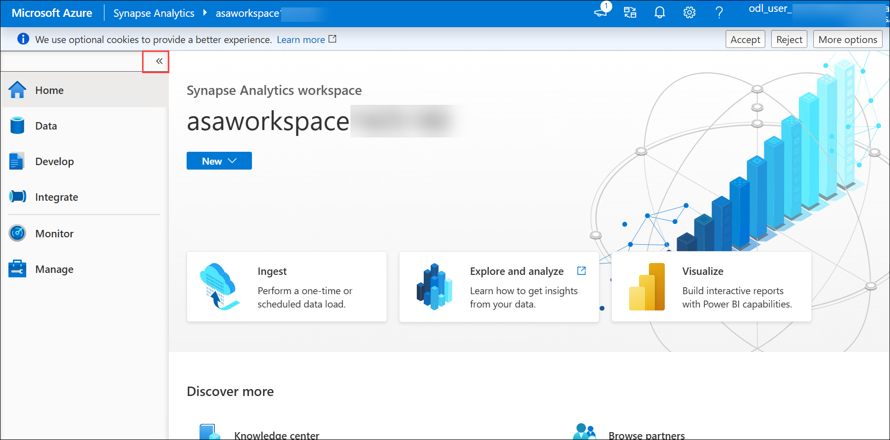
   
     >**Note:** Ignore if you receive any pop-up like **Failed to load** as shown below by clicking on **OK**.
       
      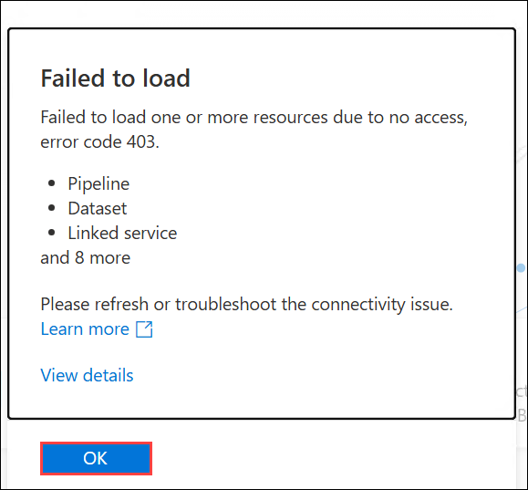
    
### Task 2: Create a Data Explorer pool

In this task, you will create a Data Explorer pool in Synapse Studio. This pool is optimized for fast data ingestion and real-time analytics. 

1. In Synapse Studio, select the **Manage (1)** page then select the **Data Explorer pools (preview) (2)** tab, and then use the **&#65291; New (3)** icon to create a new pool.

    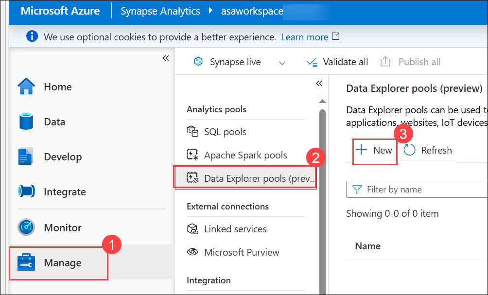

1. On the **Create Data Explorer pool** provide the following details:

    - Data Explorer pool name: **dxpool<inject key="DeploymentID" enableCopy="false" /> (1)**
    - Workload: **Compute optimized (2)**
    - Size: **Extra Small (2 cores) (3)**
    - Click on **Next: Additional Settings > (4)**
    
      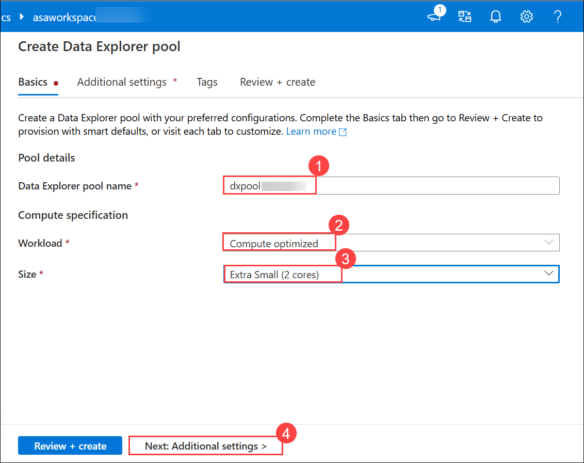

1. Enable the **Streaming ingestion (1)** setting, select **Review and create (2)** to create the Data Explorer pool.

    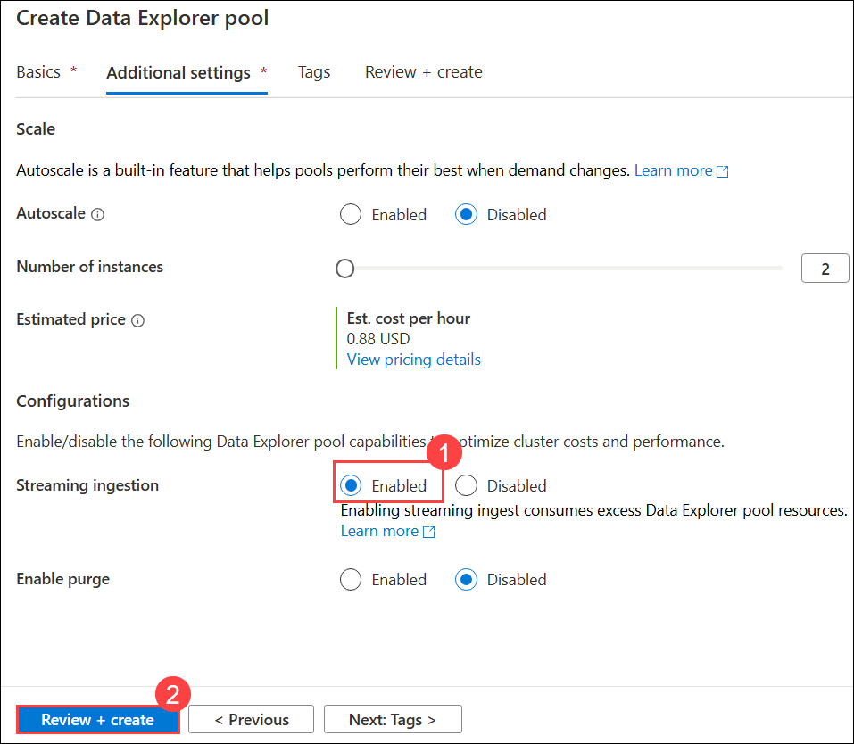

1. Then wait for it to be deployed (which may take **15** minutes or longer - the status will change from **Creating** to **Online**).

    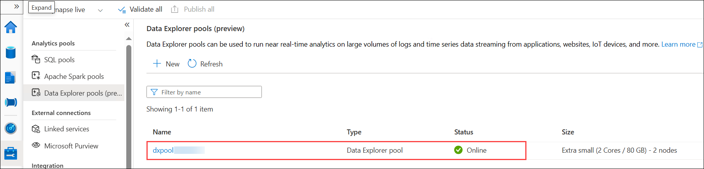

### Task 3: Create a database and ingest data

In this task, you will create a database within the Data Explorer pool and ingest data into it. This will allow you to store and analyze data using Kusto Query Language (KQL) in Synapse Studio.

1. In Synapse Studio, select the **Data (1)** page. Ensure that the **Workspace (2)** tab is selected, and if necessary, select the **&#8635;** icon at the top-left of the page to refresh the view so that **Data Explorer databases (3)** is listed.

    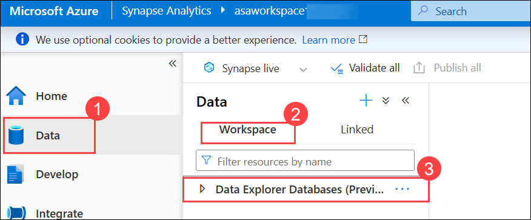

1. Expand **Data Explorer databases** and verify that **dxpool<inject key="DeploymentID" enableCopy="false" />** is listed.

    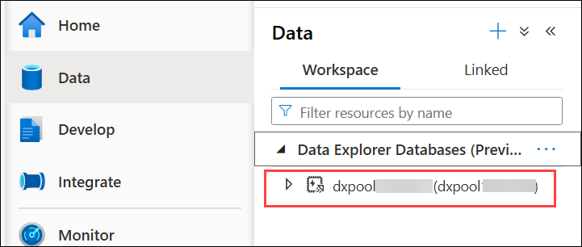

1. In the **Data** pane, click on **&#65291; (1)** icon and then **Data Explorer database(preview)** to create a new Data Explorer database.

    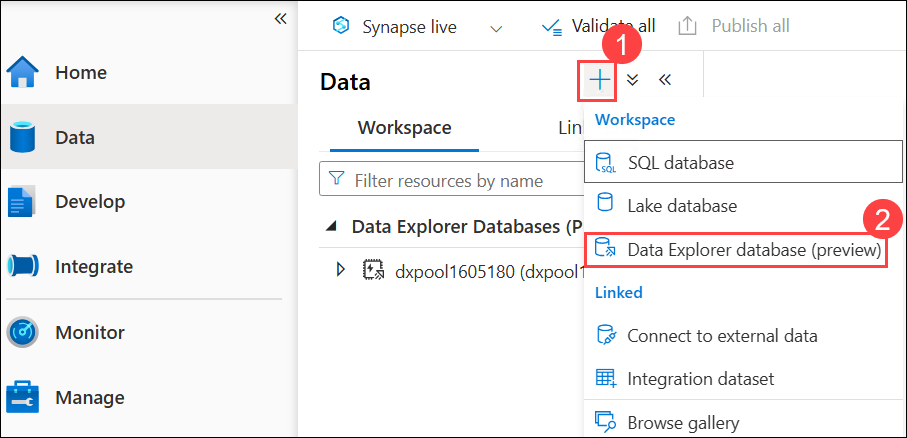

1. On the **Data Explorer database(preview)** page, provide the following details and then click on **Create (3)**.

    - Pool name: Select **dxpool<inject key="DeploymentID" enableCopy="false" />(1)** 
    - Name: **iot-data (2)**

      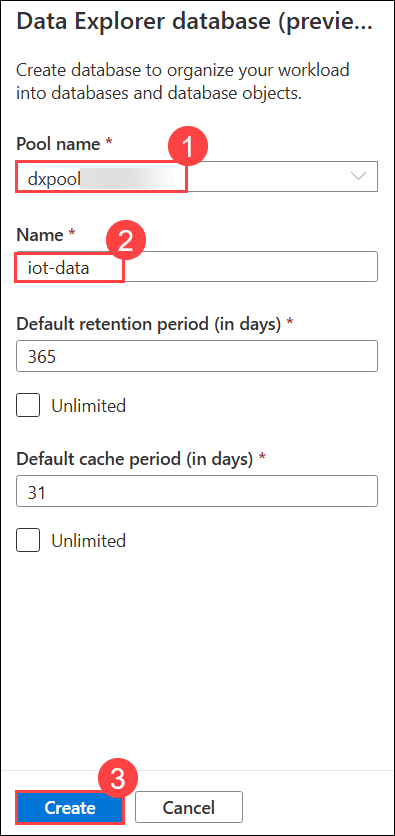
    
       >**Note:** You will not be able to create the Data Explorer Database until the Data Explorer pool is created.
    
1. While waiting for the database to be created, Right click on the following link [https://github.com/CloudLabs-MOC/DP-900T00A-Azure-Data-Fundamentals/raw/master/streaming/data/devices.csv](https://github.com/MicrosoftLearning/DP-900T00A-Azure-Data-Fundamentals/raw/master/streaming/data/devices.csv?azure-portal=true), select **Copy link** and then paste it on the browser to download **devices.csv** file.

1. Press **Ctrl+S** to save the file any folder.

1. Click on **Save**.

    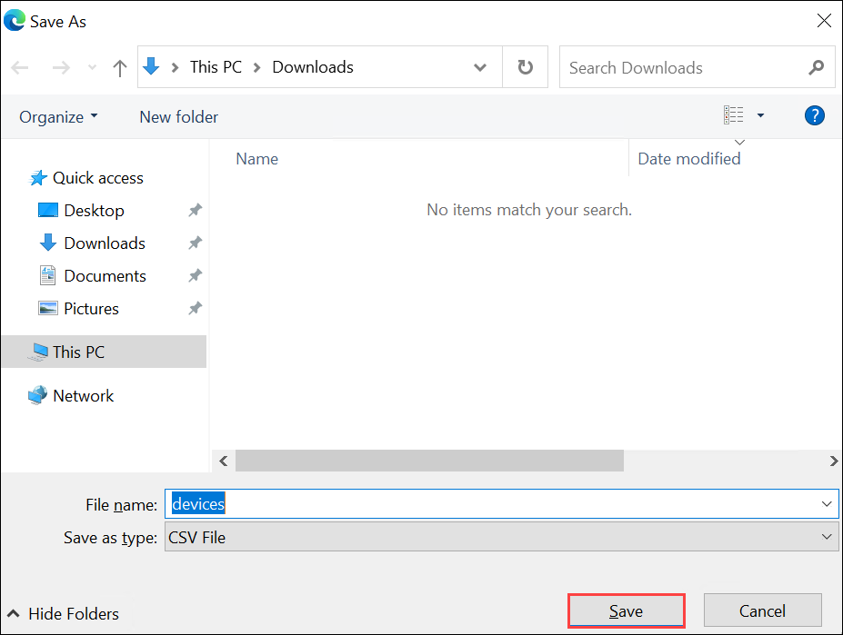

1. In Synapse Studio, wait for the database to be created if necessary, and then in the **... (1)** menu for the new **iot-data** database, select **Open in Azure Data Explorer (2)**.

    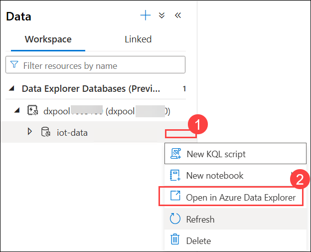

1. On the **Adding connection** page, select **Trust**.

    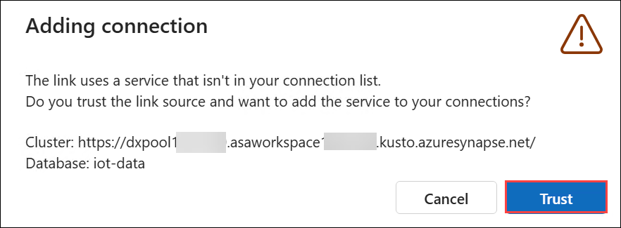

1. Click on the **Database icon**. 

    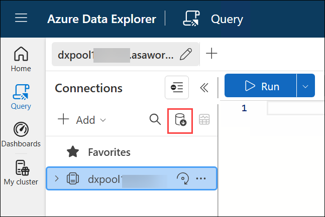

1. Select **Get data**.    
    
1. Select the **Local File**.

    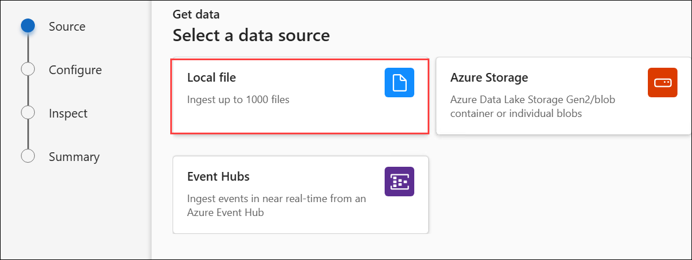

1. Click on **New table**.    

    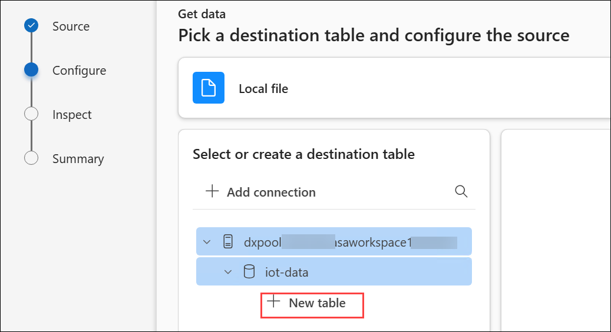

1. Type name as **devices (1)** and then click on the right mark. **(2)**

    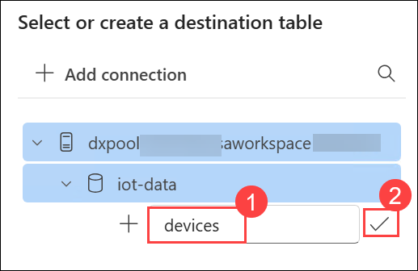

1. Click on **Browse the file**.
   
   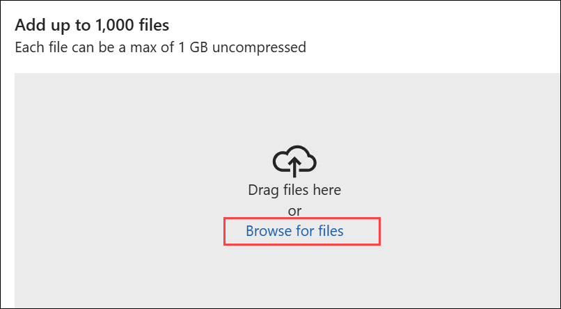

1. Navigate to **Downloads (1)**, then select **devices (2)** file and then click on **Open (3)**.   

   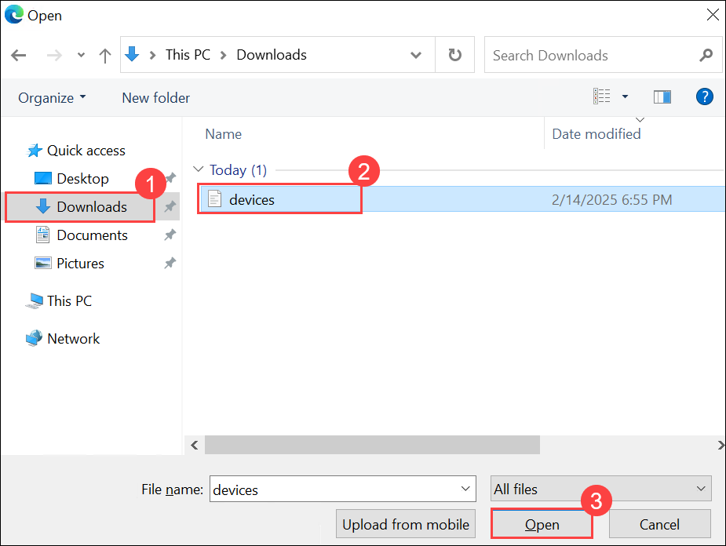

1. Now click on **Next**.

   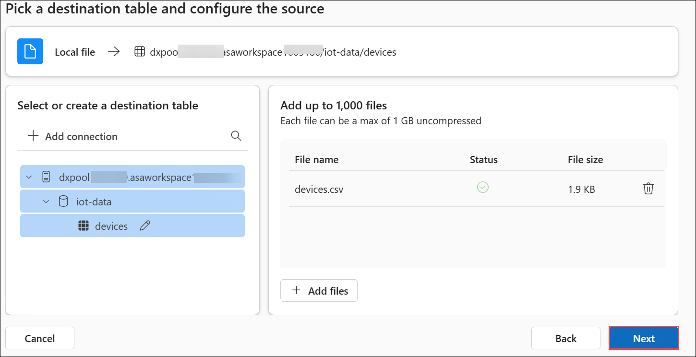

1. Click on **Edit** button to modify the Column name.

   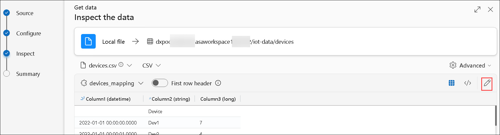

1. Rename `Column1` as **`Time`** **(1)**, `Column2` as **`Device`** **(2)** then `Column3` as **`Value`** **(3)** and then click on **Apply (4)**.

   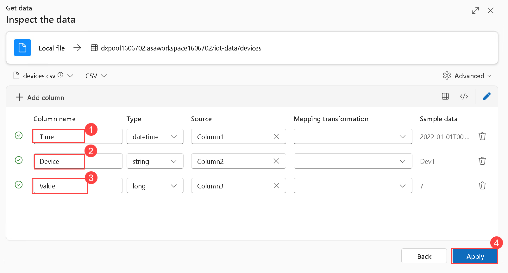

1. Ensure the column data types have been correctly identified as `Time (datetime), Device (string), and Value (long)` **(1)**. Select the **First row header (2)** to ignore the first record and then click on **Finish (3)**.  

   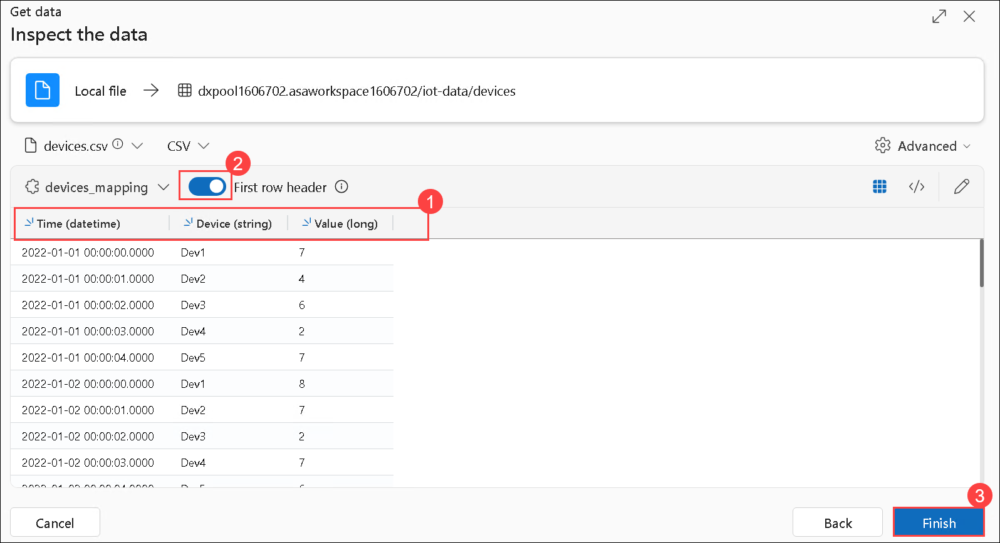

1. Click on **Close**.

1. In Azure Data Explorer, on the **Query** tab, ensure that the **iot-data (1)** database is selected and then in the query pane, enter the following query. **(2)**

    ```kusto
    devices
    ```

1. On the toolbar, select **&#9655; Run (3)** to run the query, and review the results **(4)**, which should look similar to this:

    | Time | Device | Value |
    | --- | --- | --- |
    | 2022-01-01T00:00:00Z | Dev1 | 7 |
    | 2022-01-01T00:00:01Z | Dev2 | 4 |
    | ... | ... | ... |

    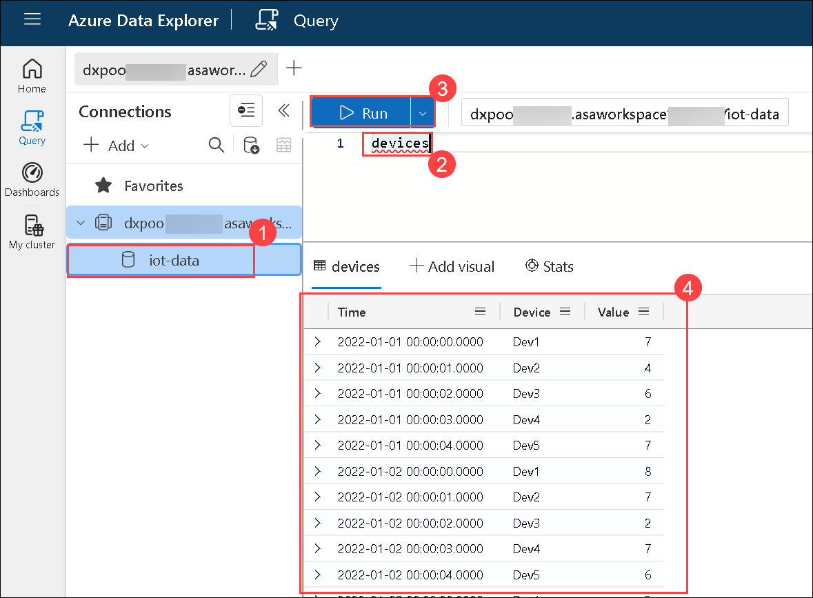    

    >**Note**: If your results match this, you have successfully created the **devices** table from the data in the file.

    >**Tip**: In this example, you imported a very small amount of batch data from a file, which is fine for the purposes of this exercise. In reality, you can use Data Explorer to analyze much larger volumes of data; and since you enabled stream ingestion, you could also have configured Data Explorer to ingest data into the table from a streaming source such as Azure Event Hubs.

### Task 4: Use Kusto query language to query the table in Synapse Studio

In this task, you will use Kusto Query Language (KQL) to query data stored in your Data Explorer database within Synapse Studio. 

1. Close the **Azure Data Explorer** browser tab and return to the tab containing **Synapse Studio**.

1. On the **Data** page, expand the **iot-data (1)** database and its **Tables (2)** folder. Verify that **devices (3)** table is present.

   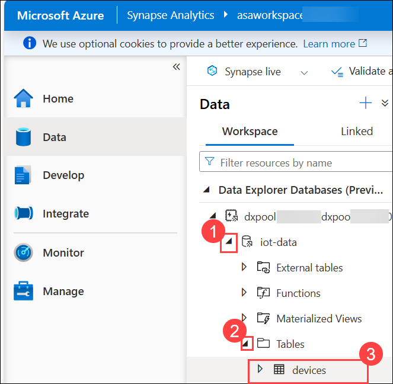

1. Then in the **... (1)** menu for the **devices** table, select **New KQL Script (2)** > **Take 1000 rows (3)**.

   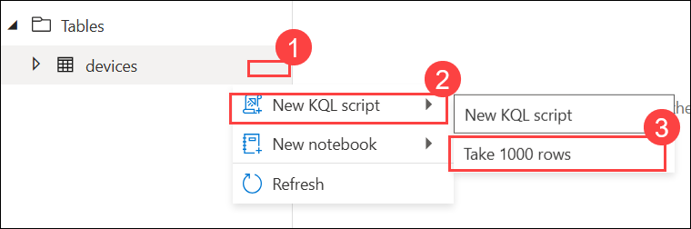

1. Review the generated query and its results. The query should contain the following code:

    ```kusto
    devices
    | take 1000
    ```

     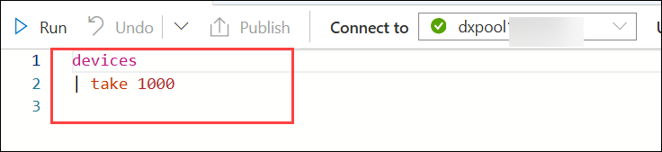    

     >**Note**: Run the query, the results of the query contain the first 1000 rows of data.

      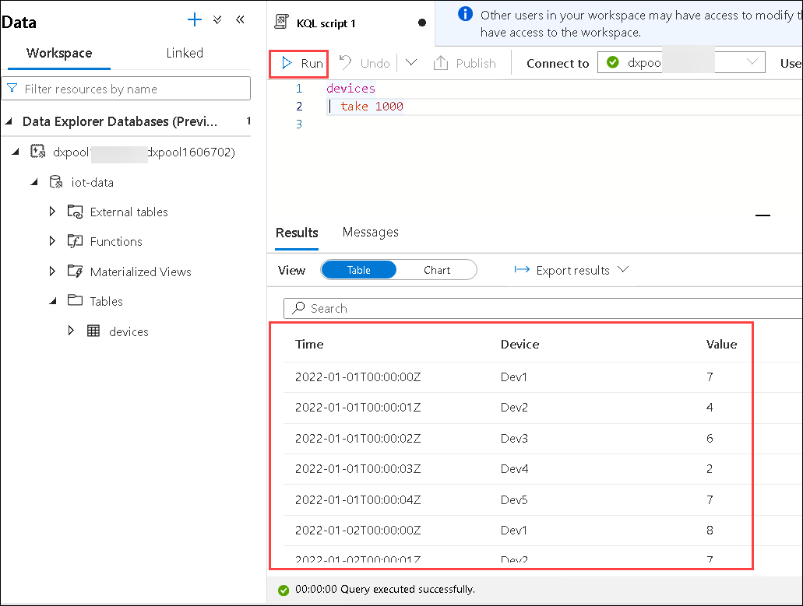      

1. Modify the query as follows: **(1)**

    ```kusto
    devices
    | where Device == 'Dev1'
    ```

1. Select **&#9655; Run (2)** to run the query. Then review the results, which should contain only the rows for the **Dev1** device. **(3)**

     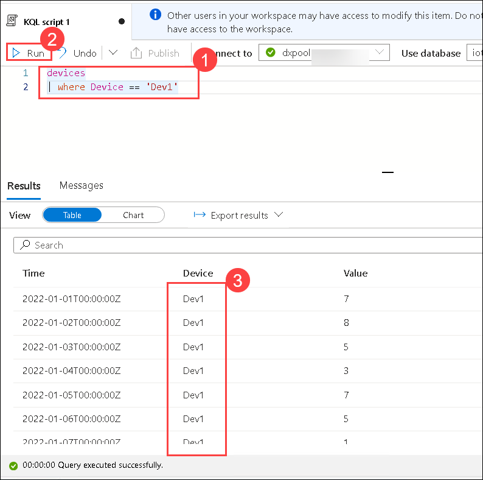 

1. Modify the query as follows: **(1)**

    ```kusto
    devices
    | where Device == 'Dev1'
    | where Time > datetime(2022-01-07)
    ```

1. **Run (2)** the query and review the results, which should contain only the rows for the **Dev1** device later than **January 7th 2022**. **(3)**

     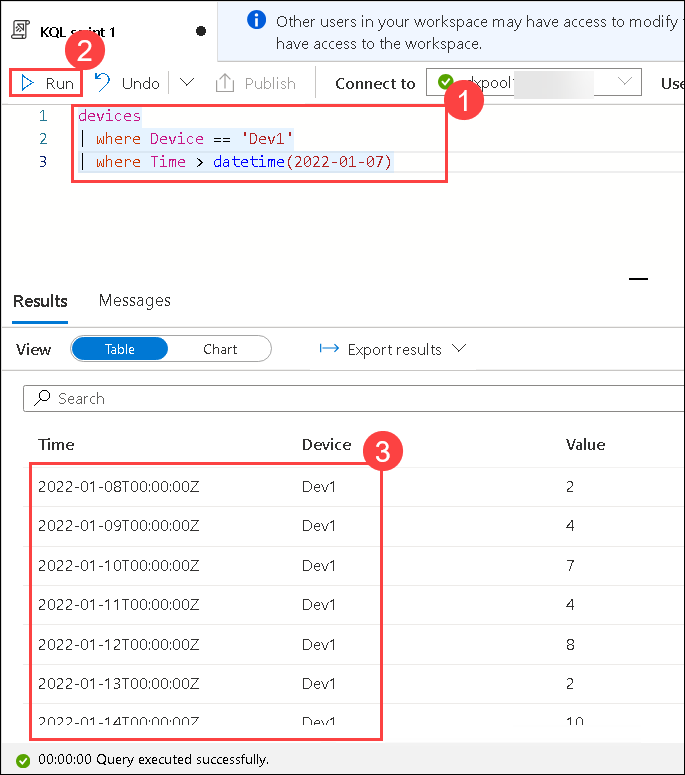 

1. Modify the query as follows: **(1)**

    ```kusto
    devices
    | where Time between (datetime(2022-01-01 00:00:00) .. datetime(2022-07-01 23:59:59))
    | summarize AvgVal = avg(Value) by Device
    | sort by Device asc
    ```

1. **Run (2)** the query and review the results, which should contain the average device value recorded between January 1st and January 7th 2022 in ascending order of device name. **(3)**

     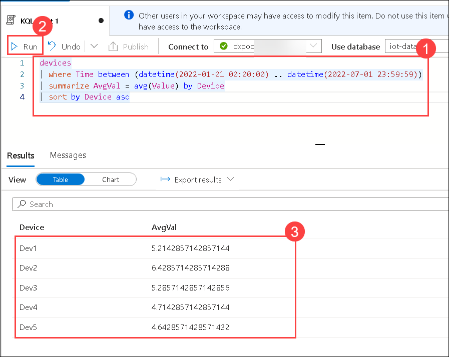 

1. Close the KQL query tab, discarding your changes.

  >**Congratulations** on completing the Task! Now, it's time to validate it. Here are the steps:
  > - Hit the Validate button for the corresponding task. If you receive a success message, you have successfully validated the lab. 
  > - If not, carefully read the error message and retry the step, following the instructions in the lab guide.
  > - If you need any assistance, please contact us at labs-support@spektrasystems.com.

   <validation step="7e0ea14a-7d31-40e0-bda5-c458e6c4c323" />

## Review
In this lab, you have completed:
- Create a Synapse Analytics workspace
- Create a Data Explorer pool
- Create a database and ingest data
- Use Kusto query language to query the table in Synapse Studio
  
## You have successfully completed this lab

