# Lab 06: Visualize data with Power BI

## Lab scenario
In this lab, you'll use Microsoft Power BI Desktop to create a data model and a report containing interactive data visualizations.

## Lab objectives

In this lab, you will perform the following tasks:

+ Task 1: Import data
+ Task 2: Explore a data model 
+ Task 3: Create a report
  
## Estimated timing: 30 minutes

## Architecture diagram


## Pre-requisites

1. Navigate to [Microsft fabric](https://app.powerbi.com/) in the LabVM browser.

1. In the Power BI tab, provide the **Email/Username: <inject key="AzureAdUserEmail"></inject>(1)** and select **Submit (2)**.

    

1. Complete the sign in process by clicking on **Continue**.

    

1. If prompted, provide the **Job title** as **xxxx (1)**, **Business phone number** as some random 10 digits **(2)** and then **Get Started (3)**.

    

1. Click on **Gey Started**.

    

1. Once logged in, navigate to **Settings (1)** icon from the top right and select **Admin Portal (2)**.

    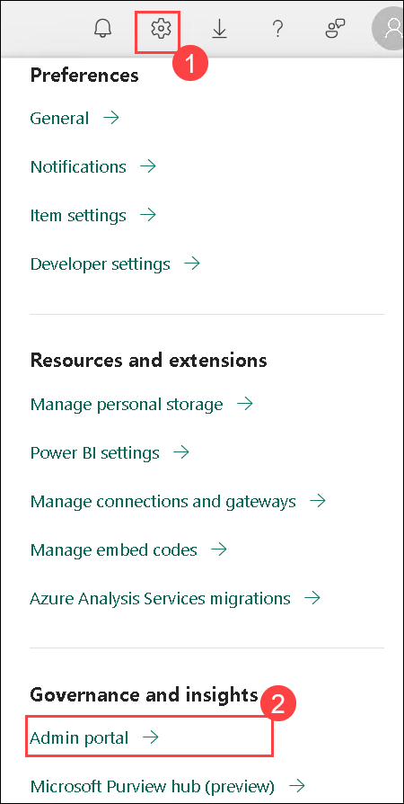

1. On the **Tenant settings (1)**, search for **map (2)** then expand **Map and filled map visuals (3)** then toggle the bar to **Enable (4)** and then click on **Apply (5)** to enable the settings.    

    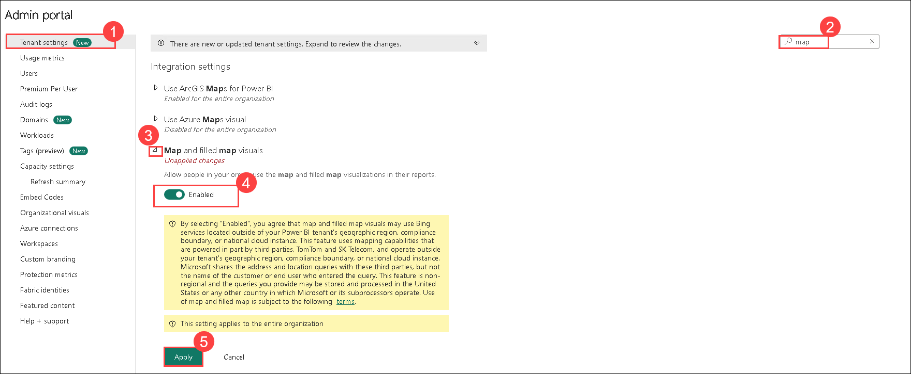

      >**Note**: It will take 15 mins to get enable, please proceede with Exercises.    

## Exercise 1: Visualize data with Power BI

### Task 1: Import data

1. Open the **Power BI Desktop** from the LabVM desktop.

    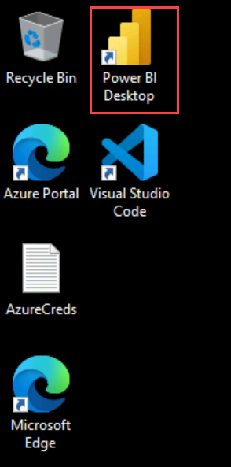

1. The application interface should look similar to this, select **Get Started**.
    
    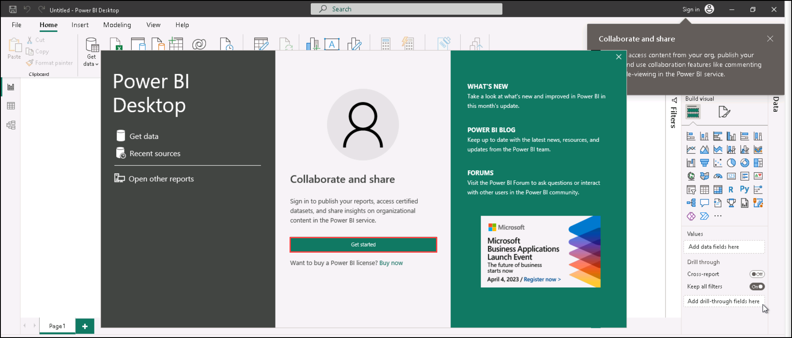
    
    Now you're ready to import the data for your report.

1. Click on **Sign in**.

    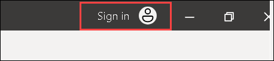

1. Provide the **Email/Username: <inject key="AzureAdUserEmail"></inject>(1)** and select **Submit (2)**.

    

1. Select **Work or School Account (1)** and then **Continue (2)**.

    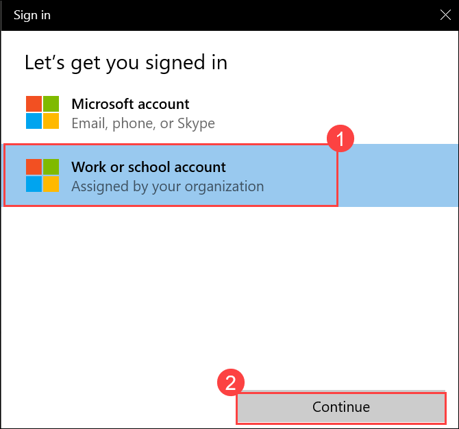

1. Sign in using the below credentials.

   - **Email/Username:** <inject key="AzureAdUserEmail"></inject>
   - **Password:** <inject key="AzureAdUserPassword"></inject>

1. Click on **No, sign into this app only**.

    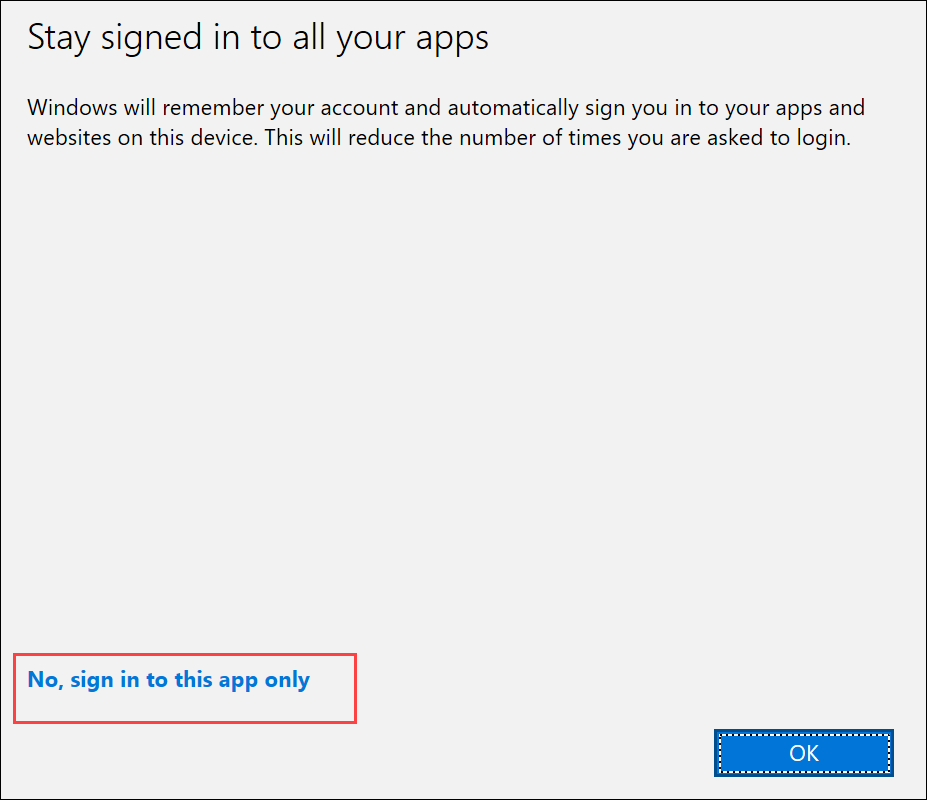

1. On the Power BI Desktop welcome screen, select  **Get data (1)**, and then in the list of data sources, select  **Web (2)**.
    
    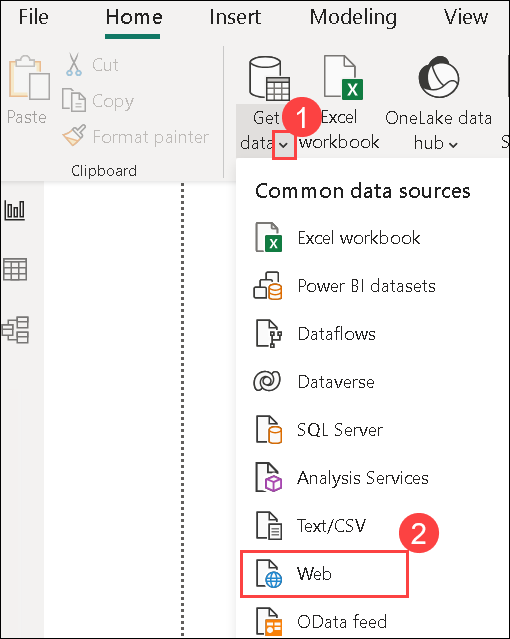
    
1. In the  **From web**  dialog box, enter the following URL **(1)** and then select  **OK (2)**:

    ```
    https://github.com/CloudLabs-MOC/DP-900T00A-Azure-Data-Fundamentals/raw/master/power-bi/customers.csv
    
    ```

     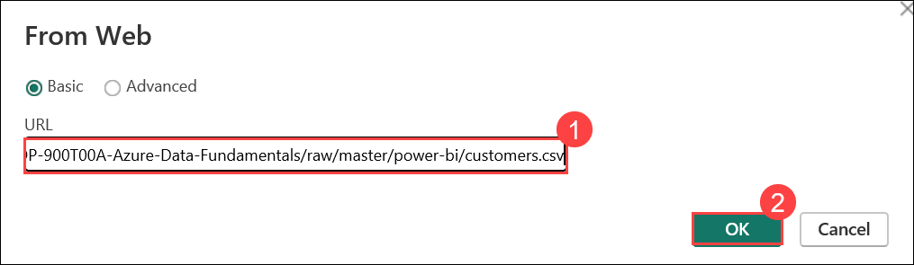    
    
1. Click on **Connect**.

    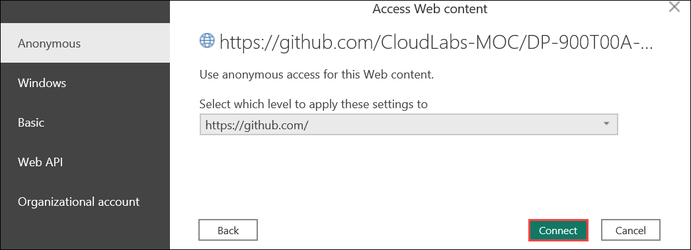

1. Verify that the URL opens a dataset containing customer data, as shown below. Then select  **Load**  to load the data into the data model for your report.
    
    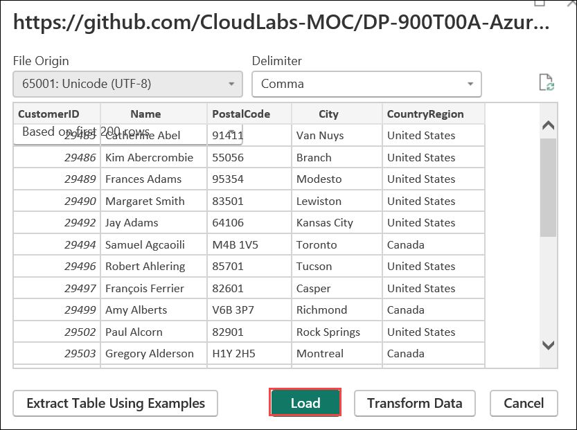
    
1. In the main Power BI Desktop window, in the  **Get data (1)**  menu, select  **Web (2)**:
    
    
    
1. In the  **From web**  dialog box, enter the following URL **(1)** and then select  **OK (2)**:
  
    ```
    https://github.com/CloudLabs-MOC/DP-900T00A-Azure-Data-Fundamentals/raw/master/power-bi/products.csv
    
    ```

     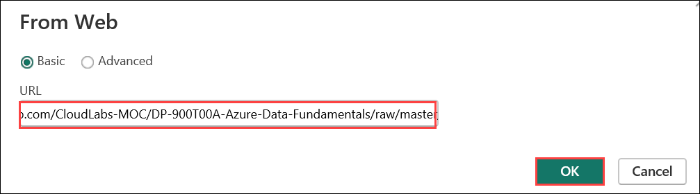       
    
1. **Load** the product data in this file into the data model.

     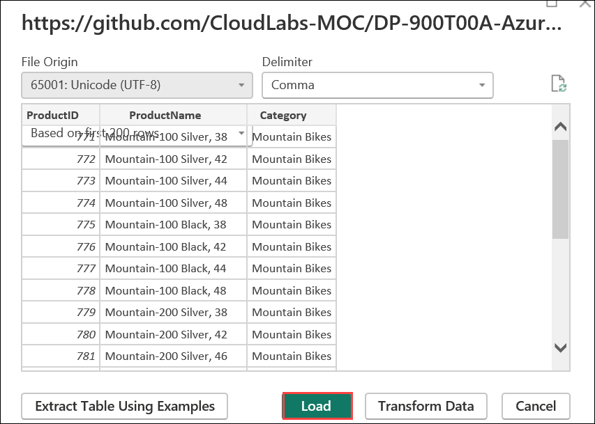   

1. Again, from the main Power BI Desktop window, in the  **Get data (1)**  menu, select  **Web (2)**:
    
    

    
1. In the  **From web**  dialog box, enter the following URL **(1)** and then select  **OK (2)**:
   
    ```
    https://github.com/CloudLabs-MOC/DP-900T00A-Azure-Data-Fundamentals/raw/master/power-bi/orders.csv
    
    ```

     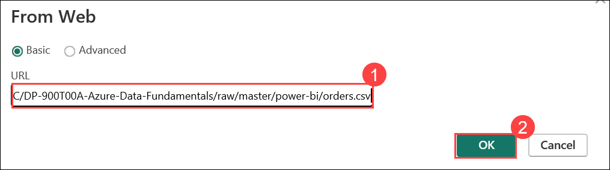       
    
1. **Load** the Order data in this file into the data model.

     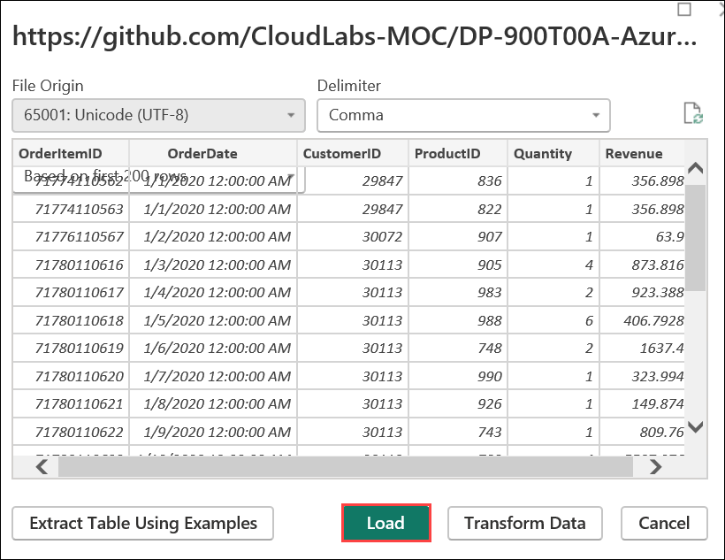      
    
### Task 2 : Explore a data model

The three tables of data you've imported have been loaded into a data model, which you'll now explore and refine.

1. In Power BI Desktop, on the left-side edge, select the  **Model**  tab, and then arrange the tables in the model so you can see them (you can hide the panes on the right side by using the  **>>**  icons):
    
    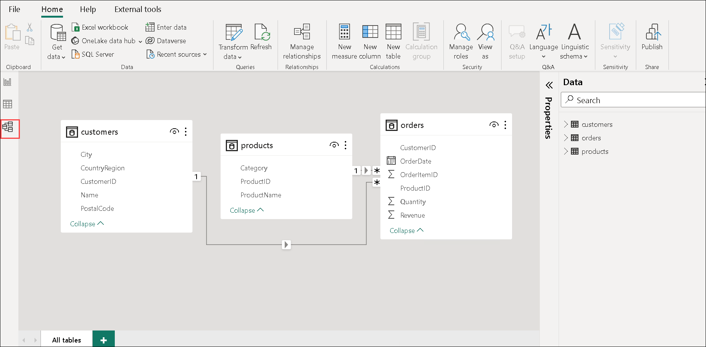
    
1. In the  **orders**  table, select the  **Revenue (1)**  field and then in the  **Properties**  pane, set its  **Format**  property to  **Currency (2)**:
    
    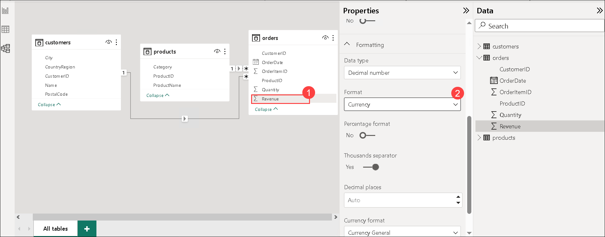
    
    This will ensure that revenue values are displayed as currency in report visualizations.
    
1. In the products table, right-click the  **Category**  field (or open its  **⋮**  menu) and select  **Create hierarchy**.

    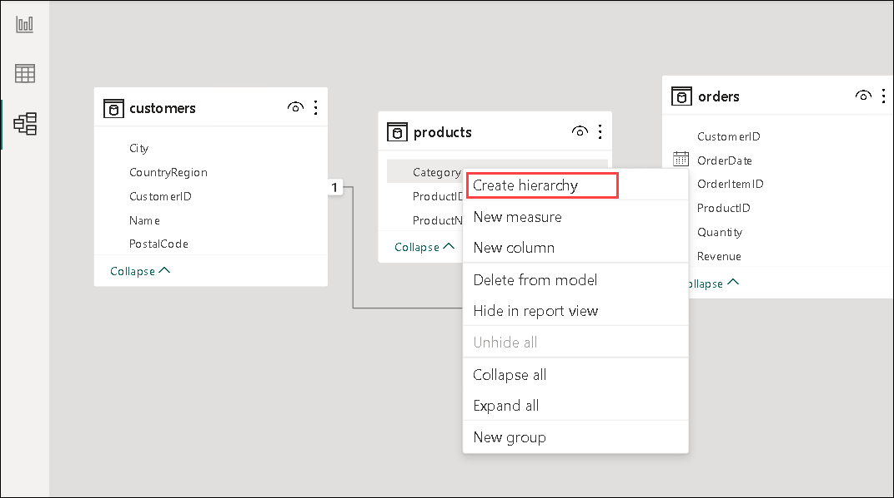

1. This creates a hierarchy named  **Category Hierarchy**  (you may need to expand or scroll in the  **products**  table to see this - you can also see it in the  **Fields**  pane)
    
    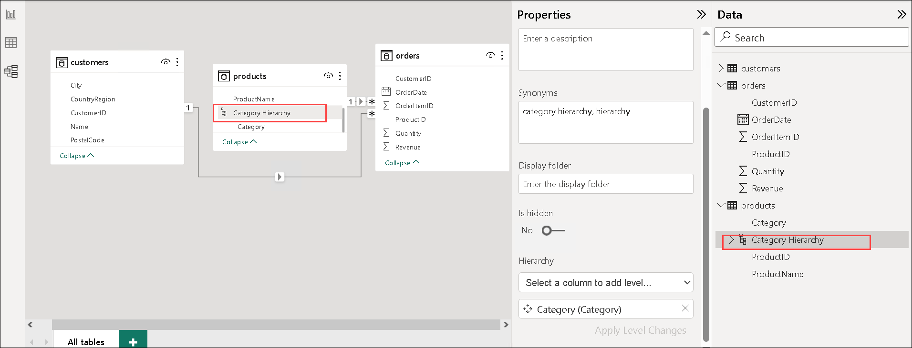
    
1. In the products table, right-click the  **ProductName (1)**  field (or open its  **⋮**  menu) and select  **Add to hierarchy (2)**  >  **Category Hierarchy (3)**. 

    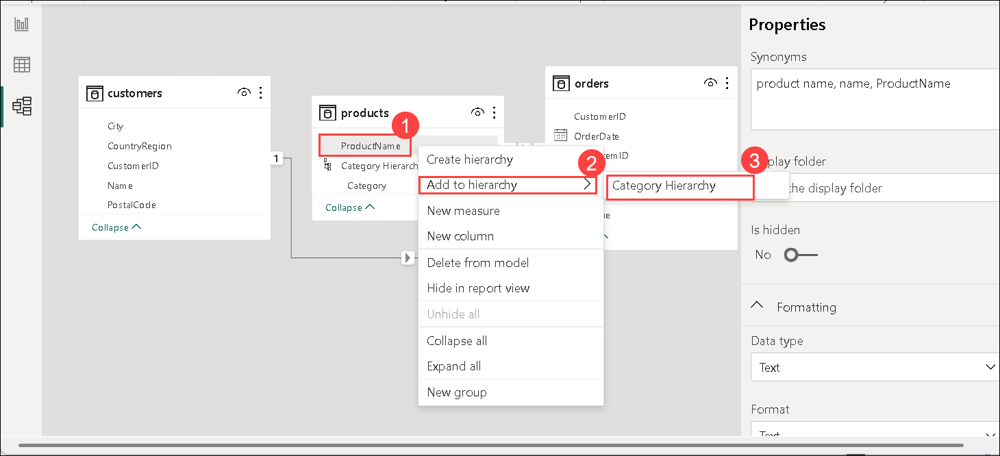

1. This adds the  **ProductName**  field to the hierarchy you created previously.

    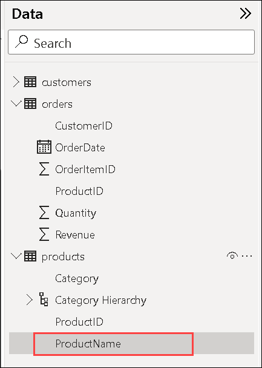
    
1. In the  **Data**  pane, right-click  **Category Hierarchy**  (or open its  **...**  menu) and select  **Rename**. The hierarchy will be renamed to  **Categorized Product**.
    
    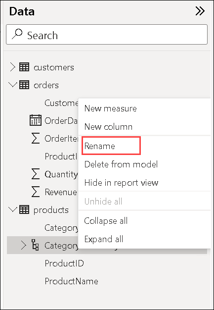

1. Rename the hierarchy to  **Categorized Product**.

    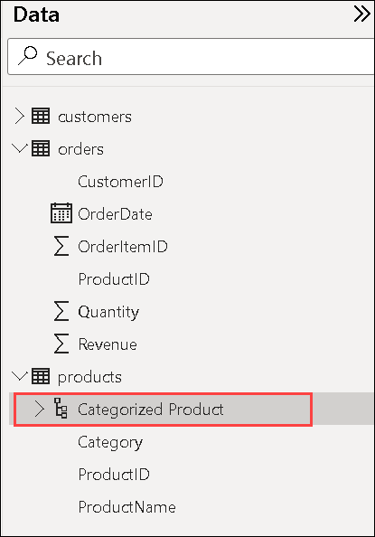
    
1. On the left-side edge, select the **Data view (1)** tab, and then in the **Data** pane, select the **customers (2)** table. Select the  **City (3)**  column header, and then set its  **Data Category**  property to  **City (4)**:
    
    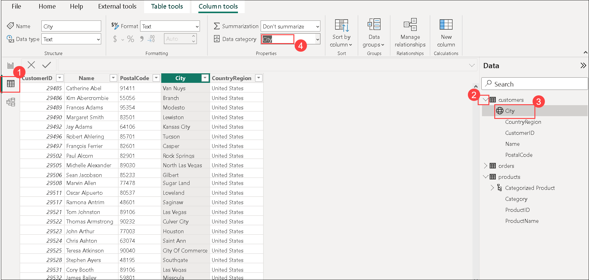
    
    This will ensure that the values in this column are interpreted as **city** names, which can be useful if you intend to include map visualizations.
    

### Task 3 : Create a report

Now you're almost ready to create a report. First you need to check some settings to ensure all visualizations are enabled.

1. Select **File** tab from top left corner.

    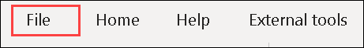

1. Select  **Options and Settings (1)**. Then select  **Options (2)**.

    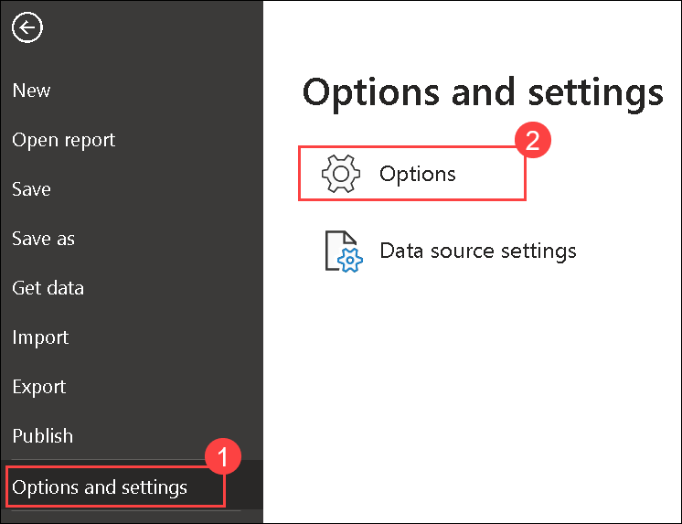

1. Navigate to the  **Security (1)**  section, ensure that  **Use Map and Filled Map visuals**  is **enabled (2)** and select  **OK (3)**.
    
    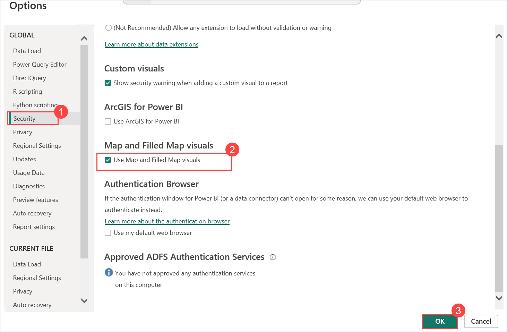
    
    This ensures that you can include map visualizations in reports.
    
1. On the left-side edge, select the  **Report**  tab and view the report design interface.
    
    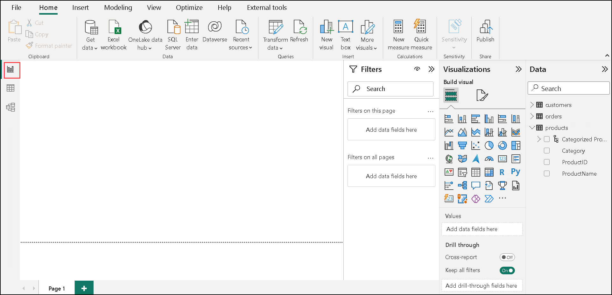
    
1. In the ribbon, above the report design surface, select  **Text Box (2)**  and add a text box containing the text  **Sales Report**  to the report. Format the text to make it bold with a font size of 32 **(2)**.
    
    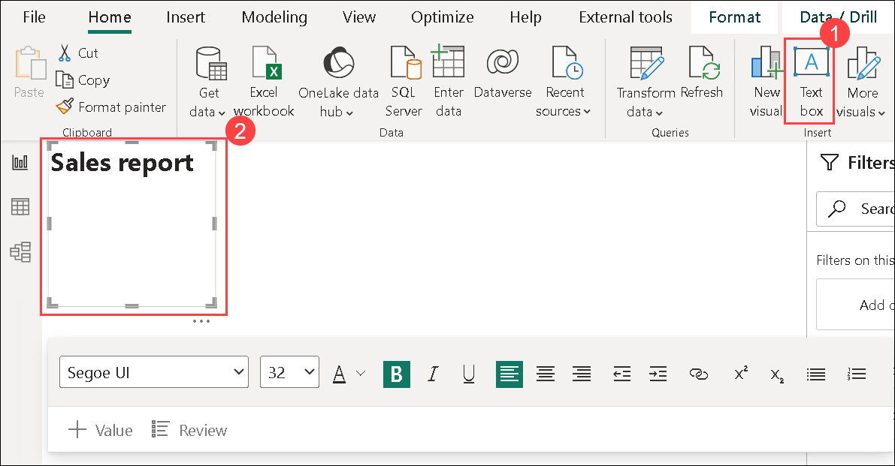
    
1. Select any empty area on the report to de-select the text box. Then in the  **Data**  pane, expand  **Products (1)**  and select the  **Categorized Products (2)**  field. This adds a table to the report. **(3)**
    
    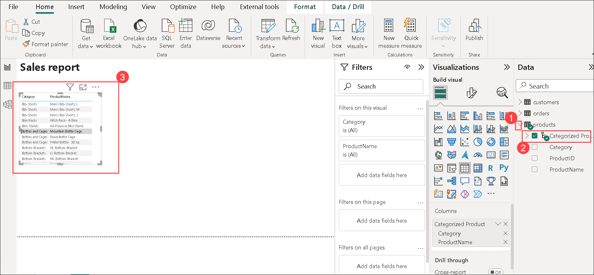
    
1. With the table still selected, in the  **Fields**  pane, expand  **Orders**  and select  **Sum of Revenue (1)**. A **Sum of Revenue** column is added to the table **(2)** (you may need to expand the size of the table to see it).

    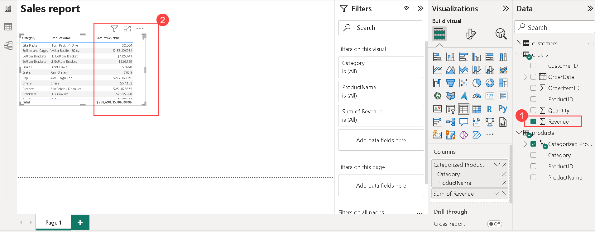
    
     >**Note**: The revenue is formatted as currency, as you specified in the model. However, you didn't specify the number of decimal places, so the values include fractional amounts. It won't matter for the visualizations you're going to create, but you could go back to the  **Model**  or  **Data**  tab and change the decimal places if you wish!
    
   
1. With the table still selected, in the  **Visualizations**  pane, select the  **Stacked column chart**  visualization. The table is changed to a column chart showing Sum of revenue by category.
    
    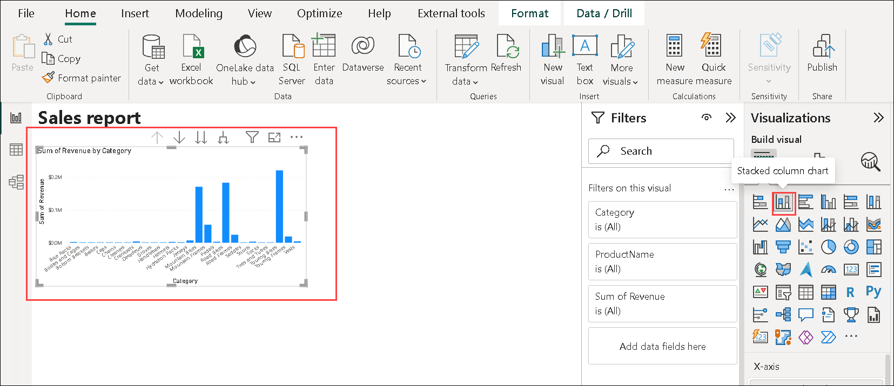
    
1. Above the selected column chart, select the **`↓`** **(1)** icon to turn on drill-down. Then in the chart, select the second column **(2)** to drill down and see the revenue for the individual products in this category. This capability is possible because you defined a hierarchy of categories and products.
    
    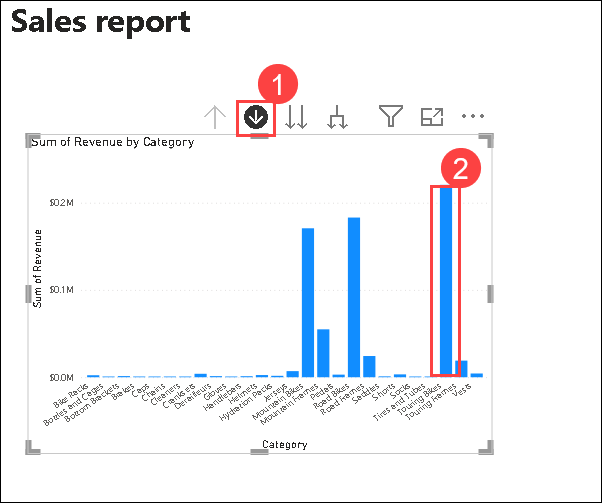

    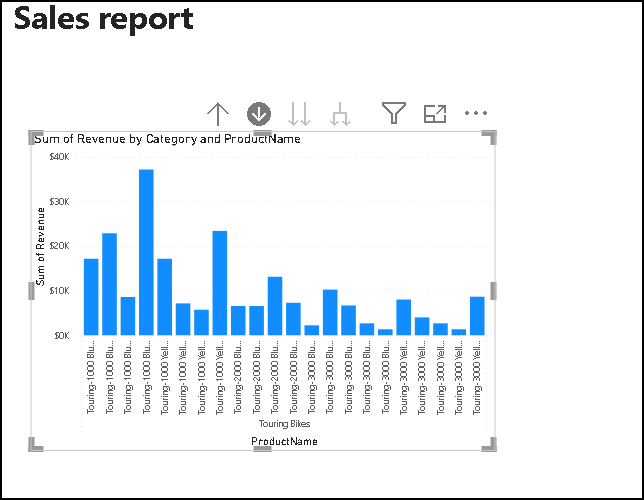
    
    
1. Use the **`↑`** **(1)** icon to drill back up to the category level. Then select the **(↓)** **(2)** icon to turn off the drill-down feature.

    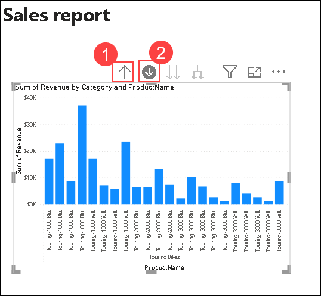
    
1. Select a blank area of the report, and then in the  **Data**  pane, select the  **Quantity (1)**  field in the  **orders**  table and the  **Category (2)**  field in the  **products**  table. This results in another column chart showing sales quantity by product category. **(3)**

    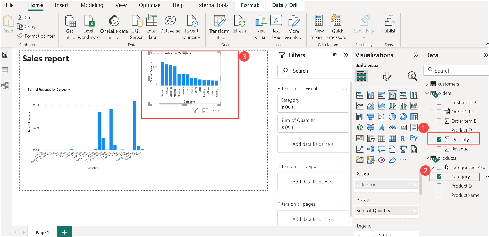
    
1. With the new column chart selected, in the  **Visualizations**  pane, select  **Pie chart**  and then resize the chart and position it next to the revenue by category column chart.
    
     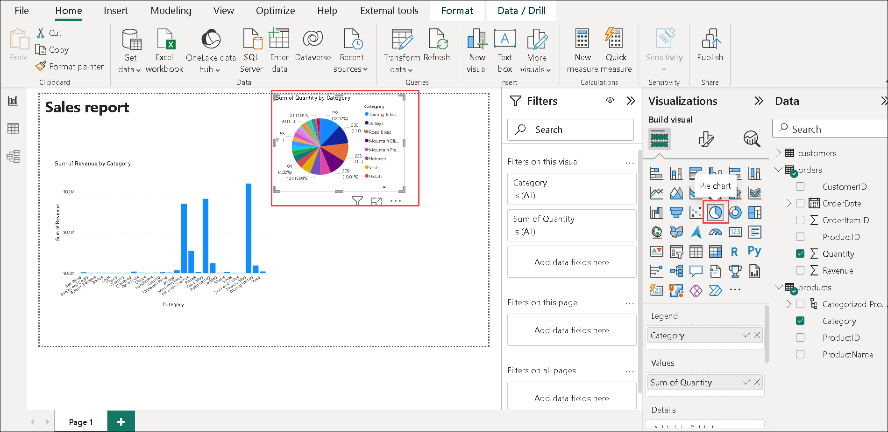
    
1. Select a blank area of the report, and then in the  **Fields**  pane, select the  **City**  field in the  **customers**  table and then select the  **Revenue**  field in the  **orders**  table. This results in a map showing sales revenue by city (rearrange and resize the visualizations as needed):
    
     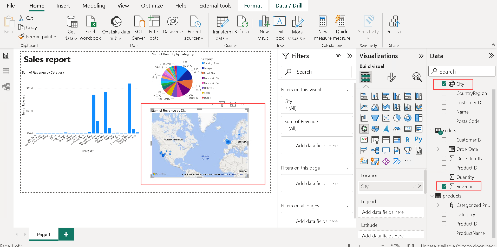
    
12.  In the map, note that you can drag, double-click, use a mouse-wheel, or pinch and drag on a touch screen to interact. *Then select a specific city, and note that the other visualizations in the report are modified to highlight the data for the selected city*.
    
     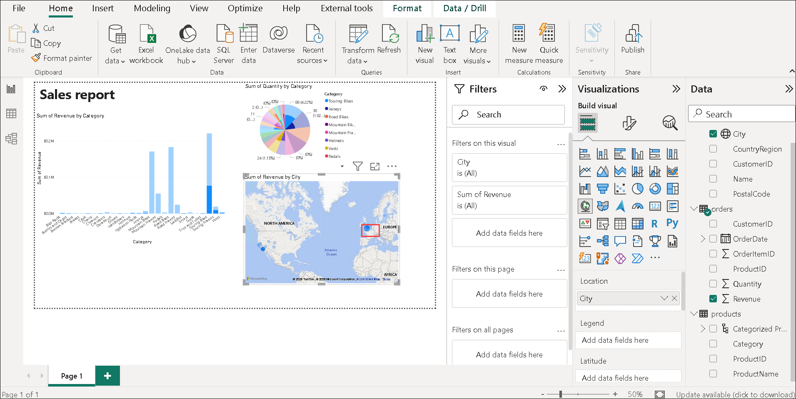
    
13.  On the  **File**  menu, select  **Save**. Make sure to save it in the Documents folder. Then save the file with **chart-<inject key="DeploymentID" enableCopy="false" />.pbix** file name. You can open the file and explore data modeling and visualization further at your leisure.

     >**Note**: In this exercise, you have used Power BI Desktop to ingest data, create a data model, and use interactive visualizations to create a report. If you have a  [Power BI service](https://www.powerbi.com/)  subscription, you can sign into your account and publish the report to a Power BI workspace.

  > **Congratulations** on completing the Task! Now, it's time to validate it. Here are the steps:
  > - Hit the Validate button for the corresponding task. If you receive a success message, you have successfully validated the lab. 
  > - If not, carefully read the error message and retry the step, following the instructions in the lab guide.
  > - If you need any assistance, please contact us at labs-support@spektrasystems.com.

   <validation step="9bcb34ed-c80a-479b-add9-231776c2e3df" />

## Review
In this lab, you have completed:
- Import data
- Explore a data model
- Create a report
  
## You have successfully completed this lab

